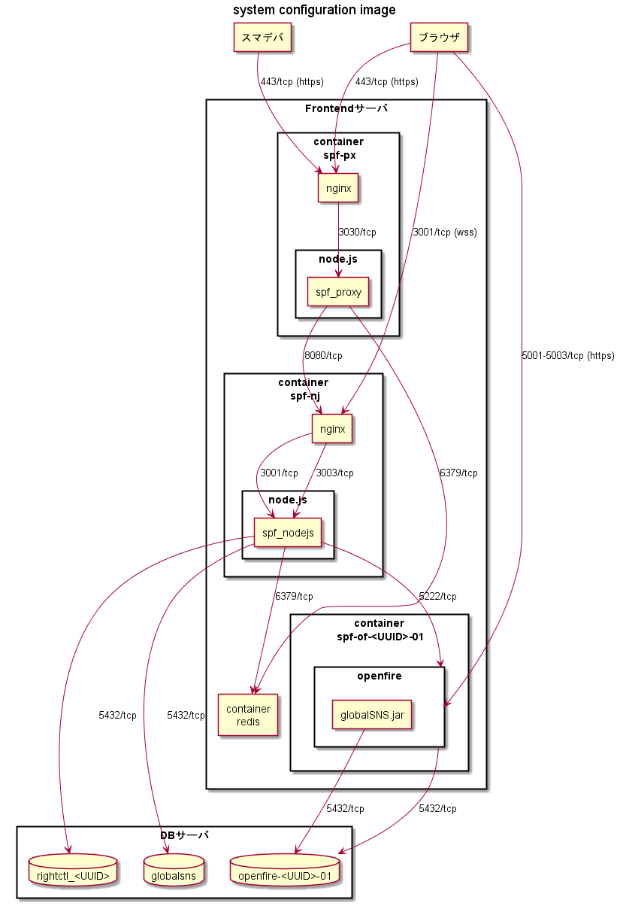

システム構成
===

## 構成図

本システムの構成は、下図のとおり。



## 構成要素

以下のOSS、プログラムで構成する。

* Frontendサーバ
    * サーバにインストールするOSS
        * redis-cli 3.0.7
        * Docker version 1.12.6
        * docker-compose version 1.14.0
    * サーバにインストールするツール類
        * python-pip
            * crudini
        * yq
        * jq
        * gcc
        * make
    * docker iamge 内で利用するOSS,プログラムのうち、主要なもの（※1）
        * 公式 image
            * centos:centos7.3.1611
            * centos:centos6
            * redis:3.0.7
            * node:boron
        * 主要なOSS,プログラム
            * java-1.8.0-openjdk
            * openfire-3.8.2-1
            * node.js v6.11.4
            * nginx-1.12.2
            * ImageMagick 7.0.7
* DBサーバ
    * サーバにインストールするOSS
        * postgresql96-server-9.6.7

※1 詳細は、各 Dockerfile を参照のこと。


## データの保管について

本システムのデータは、DBサーバのDB、および、Frontendサーバの以下の場所に格納される。

```
/var/lib/docker/volumes/opt_cubee_node_data/_data/
```


## ログのローテーションについて

本システムのログは、Frontendサーバの下記の場所に出力される。  
ただし、構築時の、パラメータ設定による。

```
/var/log/rebecca/center/
```

ローテーションの設定については、以下のファイルを参照。

* /etc/logrotate.d/nginx
* /etc/logrotate.d/nodejs
* /etc/logrotate.d/redis
* /var/lib/docker/volumes/opt_openfire_conf/<TENANT_UUID>-01/log4j.xml

原則、1日を1世代とし、397世代を上限としてローテーション（退避ファイルは圧縮）をしている。  
ただし、`/var/log/rebecca/center/spf-dckr-of-<TENANT_UUID>/` 配下に出力されるログは、  
世代上限設定を行っておらず、一定期間での削除作業が必要。


以上
