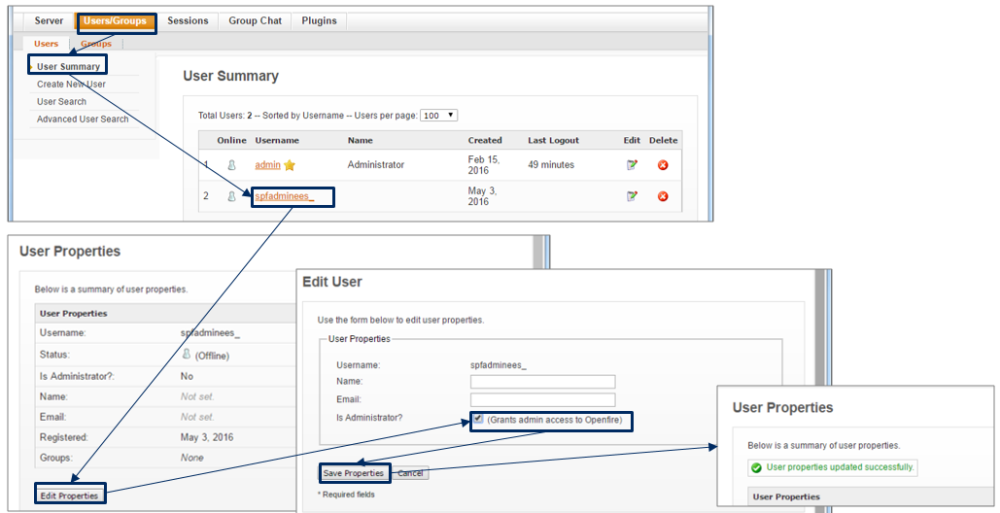

テナント管理者の追加
===

新規に本製品を構築したときの初期テナント構築時や、テナントを増設したときには、そのテナントにはシステム管理者アカウントのみが存在する。  
テナント管理者を追加する手順について説明する。

## 目次

1. [パラメータの決定](#define)
1. [admintool からアカウントを追加](#add)
1. [Openfire管理コンソールで権限を付与](#previledge)

##  パラメータの決定

テナント管理者に関する以下の情報を決定する。

* アカウント名
* ニックネーム
* アカウントタイプ
* 初期パスワード

##  admintool からアカウントを追加

本製品のadmintoolにアクセスし、システム管理者アカウントでログインする。

`https://<Frontendサーバのアドレス>/cubee/admintool/`

テナント名、システム管理者アカウントのアカウント名、パスワードが必要。  
初期テナントの場合、下表が該当する。

| 項目 | パラメータ名 |
| -- | -- |
| テナント名 | `/root/cubee-dev/building/parameters.sh` の `TENANT_NAME` |
| アカウント名 | admin |
| パスワード | `/root/cubee-dev/building/parameters.sh` の `CUBEE_OPENFIRE_PW` |

新規登録操作で、テナント管理者アカウントを作成する。

##  Openfire管理コンソールで権限を付与

Openfire の管理コンソールをブラウザで開く。

`https://<Frontendサーバのアドレス>:<テナント毎のOpenfire管理コンソールのポート>`

テナント毎のOpenfire管理コンソールのポートは、  
`/root/cubee-dev/building/parameters.sh` の `OPENFIRE_WEB_PORT` が該当する。

システム管理者アカウント admin でログインする。  
下図を参考に、テナント管理者アカウントに、管理者権限を付与する。

以上
