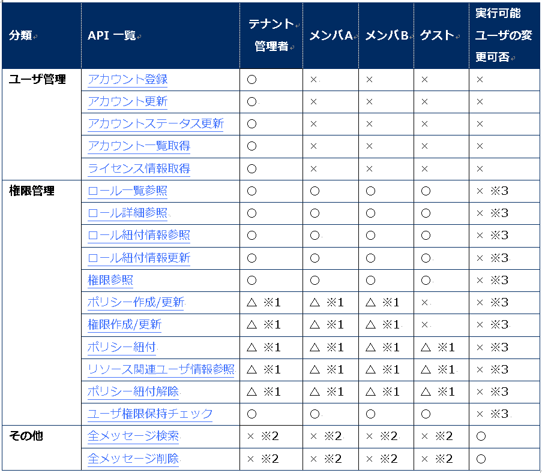

企業向けソーシャルプラットフォーム　管理系WebAPIリファレンスマニュアル
---

## 1.はじめに

この文書は「企業向けソーシャルプラットフォーム」の 管理系WebAPIについて記載したものです。

## 1.1.管理系WebAPIでできること

テナント管理者、及びシステム運用者向けのAPIとなります。

+ テナント管理者向け
  + テナント管理者のみが実行可能なテナントを管理、運用するための操作を行います。

+ システム運用者向け
  + 投稿されたすべてのメッセージの検索、及びメッセージの削除を行います。
  + 権限管理におけるアカウントタイプの一覧や割当、プロジェクトやグループチャットに所属するユーザへの権限の割当などを行います。

## 1.2.注意事項

本記載の情報はバージョンアップ等により、予告なく変更される可能性があります。

> :warning: **注意**
>一部、実行の仕方によってはシステムが正常に動作しなくなるAPIが存在します。
本書に記載されているAPIをご利用を検討の際は、サービス提供者もしくはシステム提供者へお問い合わせください。

## 2.WebAPI一覧

## 2.1.アクセス先

以下のURLにPOSTメソッドでアクセスします。
テナント名を指定する場合と指定しない場合が存在します。
マルチテナント環境をご利用の際はログインAPI実行の際のみテナント名を指定してください。アクセストークンを取得した後はテナント名を指定せずともログインしたテナントでのAPIの実行が可能です。

+ テナント名を指定しないパターン
  + http(s)://<cubeeサイトのホスト名orIPアドレス>/<cubee_root>/asynchronous/
+ テナント名を指定するパターン
  + http(s)://<cubeeサイトのホスト名orIPアドレス>/<cubee_root>/t/<テナント名>/asynchronous/

※httpsはSSLをサポートしている時のみ
APIのデータをPOSTメソッドのパラメータに設定して送信します。

## 2.2.API一覧 及び 実行可能ユーザの対応表

APIの分類ごとの一覧と実行可能なユーザを示しています。
メンバA、メンバB、ゲストはアカウントタイプを示しており、それぞれの有する権限はテナント管理者ガイドを参照してください。
実行可能ユーザの変更可否はアカウントタイプを変更することにより、実行するユーザを変更することが可能か否かを示しています。

※1：所属するプロジェクト/グループチャット内で与えられた権限により変化します。詳しい実行条件は各API詳細から、実行条件をご確認ください。
※2：特殊な権限を与えられたアカウントタイプを設定したユーザのみ実行が可能となります。   
※3：原則、権限管理APIの使用は推奨しておりません。

## 3.テナント管理者向けAPIの詳細

ここでは、テナント管理者用のAPIのリクエスト/レスポンスパラメータについてそれぞれ説明していきます。

## 3.1.アカウント登録

新規ユーザを登録するためのAPIです。

+ リクエスト

| キー | 必須 | データ型 | 最大文字列長 | 説明 |
| -------- | :--------: | -------- | -------- | -------- |
| accessToken | 〇 | 文字列 |  | ログインAPIにより取得したアクセストークンを指定します。 |
| request| 〇 | 文字列 |  | “CreateUser” を指定します。|
| id | － | 文字列 |  | 任意の文字列を指定します。 |
| version | － | 数値 |  | WebAPIのバージョン番号を指定します。 |
| content | 〇 | リスト |  | APIごとの入力値を格納するリストを指定します。 |
| user | 〇 | 文字列 | 60文字 | 登録ユーザのアカウント名を指定します。 |
| nickName | 〇 | 文字列 | 20文字 | 登録ユーザのニックネームを指定します。指定する文字列はURIエンコード済みのものを指定してください。 |
| password | 〇 | 文字列 | 8-32文字 | 登録ユーザの初期パスワードを指定してください。 |
| group | － | 配列 | 1グループ100文字以下(未URIエンコード)、グループは5件まで | 登録ユーザの所属グループ名を配列で指定してください。所属するグループ名はURIエンコード済みのものを指定してください。 |
| mailAddress | － | 文字列 | 256文字 | 登録ユーザのメールアドレスを指定してください。指定する文字列はURIエンコード済みのものを指定してください。 |

+ リクエストのイメージ

~~~
{
  "accessToken":"1234567890ABCDEF",
  "request":"CreateUser",
  "id":"spf",
  "version":4,
  "content":{
    "user":"suzuki-tarou",
    "nickName":"taro suzuki",
    "password":"pass",
    "group":[
      "information",
      "development"
    ],
    "mailAddress": "cubee%40cubee.co.jp"
  }
}
~~~

+ レスポンス

| キー | 返却 | データ型 | 説明 |
| -------- | :--------: | -------- | -------- |
| accessToken | 〇 | 文字列 | ログインAPIにより取得したアクセストークンを指定します。 |
| request | 〇 | 文字列 | “CreateUser” が返却されます。 |
| id | － | 文字列 | リクエスト時に指定した文字列が返却されます。 |
| version | － | 数値 | リクエスト時に指定した数値が返却されます。|
| errorCode | 〇 | 文字列 | 成功：0、tokenが無効の場合：9、token無効以外のエラー：1 |
| result | 〇 | 論理値 | 成功：true 、失敗：false が返却されます。 |
| reason | 〇 | 文字列 | 成功：0   指定した文字列が要件を満たしていない場合：400000   実行したユーザがテナント管理者でない場合：403000   サーバ内部エラー(ユーザ登録数が上限の場合も含む)：500000 |

+ レスポンスのイメージ

~~~
{
  "accessToken":"1234567890ABCEF",
  "request":"CreateUser",
  "id":"spf",
  "version":4,
  "errorCode":0,
  "content":{
    "result":true,
    "reason":0
  }
}
~~~

## 3.2.アカウント更新

既存のユーザの登録情報を更新するAPIです。

+ リクエスト

| キー | 必須 | データ型 | 最大文字列長 | 説明 |
| ----- | :-----: | ----- | ----- | ----- |
| accessToken | 〇 | 文字列 |  | ログインAPIにより取得したアクセストークンを指定します。 |
| request | 〇 | 文字列 |  | “UpdateUser” を指定します。 |
| id | － | 文字列 |  | 任意の文字列を指定します。 |
| version | － | 数値 |  | WebAPIのバージョン番号を指定します。 |
| content | 〇 | リスト |  | APIごとの入力値を格納するリストを指定します。 |
| user | 〇 | 文字列 | 60文字 | 更新ユーザのアカウント名を指定します。 |
| nickName | 〇 | 文字列 | 20文字 | 更新ユーザのニックネームを指定します。指定する文字列はURIエンコード済みのものを指定してください。 |
| group | － | 配列 | 1グループ100文字以下(未URIエンコード)、グループは5件まで | 更新ユーザの所属グループ名を配列で指定してください。所属するグループ名はURIエンコード済みのものを指定してください。 |
| mailAddress | － | 文字列 | 256文字 | 更新ユーザのメールアドレスを指定してください。指定する文字列はURIエンコード済みのものを指定してください。 |

+ リクエストのイメージ

~~~
{
  "accessToken":"1234567890ABCDEF",
  "request":"UpdateUser",
  "id":"spf",
  "version":4,
  "content":{
    "user":"suzuki-tarou",
    "nickName":"taro suzuki",
    "group":[
      "information","development"
    ],
    "mailAddress": "cubee%40cubee.co.jp"
  }
}
~~~

+ レスポンス

| キー | 返却 | データ型 | 説明 |
| -------- | :--------: | -------- | -------- |
| accessToken | 〇 | 文字列 | ログインAPIにより取得したアクセストークンを指定します。 |
| request | 〇 | 文字列 | “UpdateUser” が返却されます。 |
| id | － | 文字列 | リクエスト時に指定した文字列が返却されます。 |
| version | － | 数値 | リクエスト時に指定した数値が返却されます。 |
| errorCode | 〇 | 文字列 | 成功：0、tokenが無効の場合：9、token無効以外のエラー：1 |
| result | 〇 | 論理値 | 成功：true 、失敗：false が返却されます。 |
| reason | 〇 | 文字列 | 成功：0   指定した文字列が要件を満たしていない場合：400000   実行したユーザがテナント管理者でない場合：403000   サーバ内部エラー：500000 |

+ リクエストのイメージ

ユーザアカウント登録と同様の為、省略します。

## 3.3.アカウントステータス更新

ユーザの利用停止、利用停止解除を行うためのAPIです。

+ リクエスト

| キー | 必須 | データ型 | 最大文字列長 | 説明 |
| ----- | :-----: | ----- | ----- | ----- |
| accessToken | 〇 | 文字列 |  | ログインAPIにより取得したアクセストークンを指定します。 |
| request | 〇 | 文字列 |  | “UpdateUserStatus” を指定します。 |
| id | － | 文字列 |  | 任意の文字列を指定します。 |
| version | － | 数値 |  | WebAPIのバージョン番号を指定します。 |
| content | 〇 | リスト |  | APIごとの入力値を格納するリストを指定します。 |
| user | 〇 | 文字列 | 60文字 | 更新ユーザのアカウント名を指定します。 |
| status | 〇 | 数値 |  | 利用可能：0   利用停止：2 |

+ リクエストのイメージ

~~~
{
  "accessToken":"1234567890ABCDEF",
  "request":"UpdateUserStatus",
  "id":"spf",
  "version":1,
  "content":{
    "user":"suzuki-tarou",
    "status":2
  }
}
~~~

+ レスポンス

| キー | 返却 | データ型 | 説明 |
| -------- | :--------: | -------- | -------- |
| accessToken | 〇 | 文字列 | ログインAPIにより取得したアクセストークンを指定します。 |
| request |  〇 |  文字列| “UpdateUserStatus” が返却されます。 |
| id | － | 文字列 | リクエスト時に指定した文字列が返却されます。 |
| version | － | 数値 | リクエスト時に指定した数値が返却されます。 |
| errorCode |  〇 | 文字列 | 成功：0、tokenが無効の場合：9、token無効以外のエラー：1 |
| result | 〇 | 論理値 | 成功：true 、失敗：false が返却されます。 |
| reason | 〇 | 文字列 | 成功：0   指定した文字列が要件を満たしていない場合：400000   実行したユーザがテナント管理者でない場合：403000   サーバ内部エラー：500000 |

+ レスポンスのイメージ

アカウント登録と同様の為、省略します。

## 3.4.アカウント一覧取得

登録されているユーザの一覧を取得するためのAPIです。

+ リクエスト

| キー | 必須 | データ型 | 最大文字列長 | 説明 |
| ----- | :----: | ----- | ----- | ----- |
| accessToken | 〇 | 文字列 |  | ログインAPIにより取得したアクセストークンを指定します。 |
| request | 〇 | 文字列 |  | “GetUsers” を指定します。 |
| id | － | 文字列 |  | 任意の文字列を指定します。 |
| version | － | 数値 |  | WebAPIのバージョン番号を指定します。 |
| content | 〇 | リスト |  | APIごとの入力値を格納するリストを指定します。 |
| except | 〇 | 配列 | 64文字 | 取得対象に含めないユーザのアカウント名のIDを指定します。指定しない場合は空としてください。 |
| start | 〇 | 数値 |  | 取得開始件数を指定してください。  1以上の数値で入力してください。 |
| count | 〇 | 数値 |  | ユーザの取得数を指定してください。   1以上の数値で入力してください。 |

+ リクエストのイメージ

~~~
{
  "accessToken":"1234567890ABCDEF",
  "request":"GetUsers",
  "id":"spf",
  "version":0,
  "content":{
    "except": [],
    "start": 0,
    "count": 100
  }
}
~~~

+ レスポンス

| キー | 返却 | データ型 | 説明 |
| -------- | :--------: | -------- | -------- |
| accessToken | 〇 | 文字列 | ログインAPIにより取得したアクセストークンを指定します。 |
| request | 〇 | 文字列 | “GetUsers” が返却されます。 |
| id | － | 文字列 | リクエスト時に指定した文字列が返却されます。 |
| version | － | 数値 | リクエスト時に指定した数値が返却されます。 |
| errorCode | 〇 | 文字列 | 成功：0、tokenが無効の場合：9、token無効以外のエラー：1 |
| result | 〇 | 論理値 | 成功：true 、失敗：false が返却されます。 |
| reason | 〇 | 数値 | 成功：0   指定した文字列が要件を満たしていない場合：400000   実行したユーザがテナント管理者でない場合：403000   サーバ内部エラー：500000 |
| allCount | 〇 | 数値 | exceptにて指定された以外の返却対象となるユーザ数が格納されます。 |
| notDeleteCount | 〇 | 数値 | allCountから利用停止ユーザ数を除いた数が格納されます。 |
| count | 〇 | 数値 | リクエストによって返却されるユーザ数が格納されます。 |
| id | 〇 | 数値 | ユーザのidが格納されます。 |
| jid | 〇 | 文字列 | ユーザのjidが格納されます。 |
| loginAccount | 〇 | 文字列 | ユーザのアカウント名が格納されます。 |
| nickName | 〇 | 文字列 | ユーザのニックネームが格納されます。 |
| status | 〇 | 数値 | ユーザの利用可能状態が格納されます。   利用可能：0   利用停止中：2 |
| group | 〇 | 配列 | 所属グループが配列にて格納されます。 |
| mailAddress | 〇 | 文字列 | ユーザのメールアドレスが格納されます。 |
| isAdmin | 〇 | 論理値 | ユーザがテナント管理者であるかどうかを示すboolean値が格納されます。 |

+ レスポンスのイメージ

~~~
{
    "request": "GetUsers",
    "id": "loginapitest",
    "version": 4,
    "errorCode": 1,
    "content": {
        "result": true,
        "reason": 0,
        "extras": {
            "allCount": "18",
            "notDeleteCount": "17"
        },
        "count": 10,
        "items": [
            {
                "id": 17,
                "jid": "aaaacoes@spf-dckr-of-aa944196-e5d5-11e5-84b4-000c29690167-01",
                "loginAccount": "aaaa",
                "nickName": "hogehoge10",
                "status": 0,
                "group": [“group"],
                "mailAddress": "a%40test.com",
                "isAdmin": false
            },
            ....繰り返し
     ]
   }
}
~~~

## 3.5.ライセンス情報取得

ご利用中のテナントにて設定されているライセンス情報から、登録可能なユーザ数などの情報を参照するためのAPIです。

+ リクエスト

| キー | 必須 | データ型 | 最大文字列長 | 説明 |
| ----- | :-----: | ----- | ----- | ----- |
| accessToken | 〇 | 文字列 |  | ログインAPIにより取得したアクセストークンを指定します。 |
| request | 〇 | 文字列 |  | “GetLicenseInfo” を指定します。 |
| id | － | 文字列 |  | 任意の文字列を指定します。 |
| version | － | 数値 |  | WebAPIのバージョン番号を指定します。 |
| content | 〇 |  |  | 空のオブジェクトを指定してください。 |

+ リクエストのイメージ

~~~
{
  "accessToken":"1234567890ABCDEF",
  "request":"GetLicenseInfo",
  "id":"spf",
  "version":4,
  "content":{
  }
}
~~~

+ レスポンス

| キー | 返却 | データ型 | 説明 |
| -------- | :--------: | -------- | -------- |
| accessToken | 〇 | 文字列 | ログインAPIにより取得したアクセストークンを指定します。 |
| request | 〇 | 文字列 | “GetLicenseInfo” が返却されます。 |
| id | － | 文字列 | リクエスト時に指定した文字列が返却されます。 |
| version | － | 数値 | リクエスト時に指定した数値が返却されます。 |
| errorCode | 〇 | 文字列 | 成功：0、tokenが無効の場合：9、token無効以外のエラー：1 |
| result | 〇 | 論理値 | 成功：true 、失敗：false が返却されます。 |
| reason | 〇 | 文字列 | 成功：0   指定した文字列が要件を満たしていない場合：400000   実行したユーザがテナント管理者でない場合：403000   サーバ内部エラー：500000 |
| licensedUserCount | 〇 | 数値 | ユーザ登録上限数が格納されます。 |
| registedUserCount | 〇 | 数値 | 登録済みのユーザ数が格納されます。 |
| remainedUserCount | 〇 | 数値 | 登録可能なユーザ数が格納されます。 |

+ レスポンスのイメージ

~~~
{
  "accessToken":"1234567890ABCEF",
  "request":"GetLicenseInfo",
  "id":"spf",
  "version":4,
  "errorCode":0,
  "content":{
    "result":true,
    "reason":0,
    "licensedUserCount":200,
    "registedUserCount":15,
    "remainedUserCount":185
  }
}
~~~

## 4.権限管理APIの詳細

権限管理機能を管理するためのAPIです。各APIの実行条件はそれぞれの詳細をご参照ください。  
また、一部のAPIは意図しない値を指定すると正常に動作しなくなる恐れがあるため、ご利用を検討の際はシステム提供者へご相談ください。

## 4.1.本章で使用する用語について

| 表記 | 説明 |
| -------- | -------- |
| ロール(role) | ユーザに対して割り当てられる、権限情報をまとめたもの。   アカウントタイプと同意。 |
| 権限(right) | ロールに対して付与される機能単位の権限情報のこと。 |
| ポリシー(policy) | 特定のリソースに個別に設定可能な権限情報をまとめたもの。ロールは複数のポリシーを所有し、権限情報をまとめている。   このポリシーとユーザ、及びリソースを紐付けることでロールに付与された権限情報とは別にリソース内のユーザに対して権限を付与することが可能となる。   ロールによって付与された権限よりも、特定のリソース内では紐付けされたポリシーに付与された権限が優先される。 |
| リソース | ポリシーを付与する対象。プロジェクト、グループチャットのルームを指す。 |
| アクション(action) | rightの構成部品の一つ。rightがどの機能に対する権限を表すのかを示すための文字列。 |

## 4.2.ロール一覧参照

テナント上で定義された、ユーザへ紐付可能なロール(アカウントタイプ)を参照するためのAPIです。
+ 実行条件

すべてのユーザが実行可能です。

+ リクエスト

| キー | 必須| データ型| 説明 |
| -------- | :--------: | -------- | -------- |
| accessToken | 〇 | 文字列 | ログインAPIにより取得したアクセストークンを指定します。 |
| request | 〇 | 文字列 | “GetRoles” を指定します。 |
| id | － | 文字列 | 任意の文字列を指定します。 |
| version | － | 数値 | WebAPIのバージョン番号を指定します。 |
| content | － | リスト | APIごとの入力値を格納するリストを指定します。 |

+ リクエストのイメージ

~~~
{
  "accessToken":"1234567890ABCDEF",
  "request":"GetRoles”,
  "id":"spf",
  "version":4,
  "content":{
  }
}
~~~

+ レスポンス

| キー | 返却 | データ型 | 説明 |
| -------- | :--------: | -------- | -------- |
| accessToken | 〇 | 文字列 | ログインAPIにより取得したアクセストークンを指定します。 |
| request | 〇 | 文字列 | “GetRoles” が返却されます。 |
| id | － | 文字列 | リクエスト時に指定した文字列が返却されます。 |
| version | － | 数値 | リクエスト時に指定した数値が返却されます。 |
| content | － | リスト | APIごとの入力値を格納するリストを指定します。 |
| errorCode | 〇 | 文字列 | 成功：0、tokenが無効の場合：9 |
| result | 〇 | 論理値 | 成功：true 、失敗：false が返却されます。 |
| reason | 〇 | 文字列 | 成功：200000   指定した文字列が要件を満たしていない場合：400000   実行する権限がない場合：403000   サーバ内部エラー：500000 |
| roles | 〇 | 配列 | ロールの一覧が格納された配列。ロール情報はroles内にリストで格納されます。 |
| id | 〇 |  | ロールID |
| t | 〇 |  | ロール名を言語別に格納したリスト |
| ja | 〇 |  | 日本語のロール名 |

+ レスポンスのイメージ

~~~
{
  "accessToken":"1234567890ABCEF",
  "request":" GetRoles ",
  "id":"spf",
  "version":4,
  "errorCode":0,
  "content":{
    "result":true,
    "reason":0,
    "role": [
            {
                "id": "admin",
                "t": {
                    "ja": "管理者"
                }
            },
            {
                "id": "normal",
                "t": {
                    "ja": "一般利用者"
                }
            },
            {
                "id": "viewer",
                "t": {
                    "ja": "閲覧者"
                }
            }
        ]
  }
}
~~~

## 4.3.ロール詳細参照

+ 実行条件

すべてのユーザが実行可能です。

+ リクエスト

| キー | 必須 | データ型 | 説明 |
| -------- | :--------: | -------- | -------- |
| accessToken | 〇 | 文字列 | ログインAPIにより取得したアクセストークンを指定します。 |
| request | 〇 | 文字列 | “GetRoles” を指定します。 |
| id | － | 文字列 | 任意の文字列を指定します。 |
| version | － | 数値 | WebAPIのバージョン番号を指定します。 |
| content | － | リスト | APIごとの入力値を格納するリストを指定します。 |
| id | 〇 | 文字列 | 詳細を参照するロールのIDを指定します。 |

+ リクエストのイメージ

~~~
{
  "accessToken":"1234567890ABCDEF",
  "request":"GetRoles”,
  "id":"spf",
  "version":4,
  "content":{
     “id”: “admin”
  }
}
~~~

+ レスポンス

| キー | 返却 | データ型 | 説明 |
| -------- | :--------: | -------- | -------- |
| accessToken | 〇 | 文字列 | ログインAPIにより取得したアクセストークンを指定します。 |
| request | 〇 | 文字列 | “GetRoles” が返却されます。 |
| id | － | 文字列 | リクエスト時に指定した文字列が返却されます。 |
| version | － | 数値 | リクエスト時に指定した数値が返却されます。 |
| errorCode | 〇 | 文字列 | 成功：0、tokenが無効の場合：9、token無効以外のエラー：1 |
| result | 〇 | 論理値 | 成功：true 、失敗：false が返却されます。 |
| reason | 〇 | 文字列 | 成功：200000   指定した文字列が要件を満たしていない場合：400000   実行する権限がない場合：403000   サーバ内部エラー：500000 |
| roles | 〇 | 配列 | 対象のロール情報を格納したリスト |
| id | 〇 | 文字列 | 対象のロールID (DBスキーマ：id) |
| role_tid | 〇 | 文字列 | 対象の名称 (DBスキーマ：t) |
| created_at | 〇 | 日付 | 作成日時 |
| updated_at | 〇 | 日付 | 更新日時 |
| t | 〇 | リスト | 名称のオブジェクト多言語のため |
| ja | 〇 | 文字列 | ja名称 (DBスキーマ：t) |
| policies | 〇 | リスト | roleに紐付いているポリシーの情報を格納したリスト(配列) |
| id | 〇 | 文字列 | roleに紐付いているポリシーのID |
| t | 〇 | リスト | 名称のオブジェクト多言語のため |
| ja | 〇 | 文字列 | ja名称 (DBスキーマ：t) |
| rights | 〇 | リスト | ロールに紐付いている権限情報を格納したリスト |
| ID名 | 〇 | 文字列 | 権限情報ID（名前）が実行可能かどうかのtrue,false |

+ レスポンスのイメージ

~~~
{
    "request": "GetRoles",
    "id": "spf",
    "version": 0,
    "errorCode": 0,
    "content": {
        "result": true,
        "reason": 200000,
        "role": {
            "id": "admin",
            "role_tid": "admin",
            "created_at": "2018-01-23T01:24:35.448Z",
            "updated_at": null,
            "t": {
                "ja": "管理者"
            },
            "policies": [
                {
                    "id": "p_create_community",
                    "t": {
                        "ja": "プロジェクト作成"
                    },
                    "rights": {
                        "createCommunity": true,
                        "manageCommunity": true
                    }
                },
                {
                    "id": "p_create_groupchat",
                    "t": {
                        "ja": "GC作成"
                    },
                    "rights": {
                        "createGroupchat": true,
                        "manageGroupchat": true,
                        "sendMessageToGroupchat": true,
                        "viewMessageInGroupchat": true
                    }
                },
                {
                    "id": "p_send_feed",
                    "t": {
                        "ja": "フィード投稿"
                    },
                    "rights": {
                        "sendMessageToFeed": true,
                        "viewMessageInFeed": true
                    }
                }
            ]
        }
    },
    "accessToken": "1234567890ABCDEF "
}
~~~

## 4.4.ロール紐付情報参照

ユーザアカウント名を指定し、指定したユーザに割り当てられたロール(アカウントタイプ)を取得します。
+ 実行条件

すべてのユーザが実行可能

+ リクエスト

| キー | 必須 | データ型 | 説明 |
| -------- | :--------: | -------- | -------- |
| accessToken | 〇 | 文字列 | ログインAPIにより取得したアクセストークンを指定します。 |
| request | 〇 | 文字列 | “GetRoleAssignmentForUser” を指定します。 |
| id | － | 文字列 | 任意の文字列を指定します。 |
| version | － | 数値 | WebAPIのバージョン番号を指定します。 |
| content | － | リスト | APIごとの入力値を格納するリストを指定します。 |
| user_id | 〇 | 文字列 | ユーザのアカウント名を指定します。 |

+ リクエストのイメージ

~~~
{
  "accessToken":"1234567890ABCDEF",
  "request":"GetRoleAssignmentForUser”,
  "id":"spf",
  "version":4,
  "content":{
     “user_id”: “test”
  }
}
~~~

+ レスポンス

| キー | 返却 | データ型 | 説明 |
| -------- | :--------: | -------- | -------- |
| accessToken | 〇 | 文字列 | ログインAPIにより取得したアクセストークンを指定します。 |
| request | 〇 | 文字列 | “GetRoles” が返却されます。 |
| id | － | 文字列 | リクエスト時に指定した文字列が返却されます。 |
| version | － | 数値 | リクエスト時に指定した数値が返却されます。 |
| errorCode | 〇 | 文字列 | 成功：0、tokenが無効の場合：9、token無効以外のエラー：1 |
| result | 〇 | 論理値 | 成功：true 、失敗：false が返却されます。 |
| reason | 〇 | 文字列 | 成功：200000   指定した文字列が要件を満たしていない場合：400000   実行する権限がない場合：403000   サーバ内部エラー：500000 |
| roles | 〇 | 配列 | ロールの一覧が格納された配列。ロール情報はroles内にリストで格納されます。 |
| id | 〇 |  | ロールID |
| t | 〇 |  | ロール名を言語別に格納したリスト |
| ja | 〇 |  | 日本語のロール名 |

+ レスポンスのイメージ

~~~
{
    "request": "GetRoleAssignmentForUser",
    "id": "spf",
    "version": 0,
    "errorCode": 0,
    "content": {
        "result": true,
        "reason": 200000,
        "role": {
            "id": "admin",
            "t": {
                "ja": "管理者"
            }
        }
    },
    "accessToken": "1234567890ABCDEF "
}
~~~

## 4.5.ロール紐付情報更新

ユーザに紐付いているロール(アカウントタイプ)を更新します。

+ 実行条件

すべてのユーザが実行可能です。

> :warning: **注意**
> このAPIは一般ユーザには公開しないようにしてください。

+ リクエスト

| キー | 必須 | データ型 | 説明 |
| -------- | :--------: | -------- | -------- |
| accessToken | 〇 | 文字列 | ログインAPIにより取得したアクセストークンを指定します。 |
| request | 〇 | 文字列 | “AssignRoleToUser” を指定します。 |
| id | － | 文字列 | 任意の文字列を指定します。 |
| version | － | 数値 | WebAPIのバージョン番号を指定します。 |
| content | － | リスト | APIごとの入力値を格納するリストを指定します。 |
| user_id | 〇 | 文字列 | ユーザのアカウント名を指定します。 |
| role_id | 〇 | 文字列 | ユーザへ紐付けるロールIDを指定します。 |

+ リクエストのイメージ

~~~
{
  "accessToken":"1234567890ABCDEF",
  "request":"AssignRoleToUser”,
  "id":"spf",
  "version":4,
  "content":{
     “user_id”: “test”,
     “role_id”: “admin”
  }
~~~

+ レスポンス

| キー | 返却 | データ型 | 説明 |
| -------- | :--------: | -------- | -------- |
| accessToken | 〇 | 文字列 | ログインAPIにより取得したアクセストークンを指定します。 |
| request | 〇 | 文字列 | “AssignRoleToUser” が返却されます。 |
| id | － | 文字列 | リクエスト時に指定した文字列が返却されます。 |
| version | － | 数値 | リクエスト時に指定した数値が返却されます。 |
| errorCode | 〇 | 文字列 | 成功：0、tokenが無効の場合：9、token無効以外のエラー：1 |
| result | 〇 | 論理値 | 成功：true 、失敗：false が返却されます。 |
| reason | 〇 | 文字列 | 成功：200000   指定した文字列が要件を満たしていない場合：400000   実行する権限がない場合：403000   サーバ内部エラー：500000 |

+ レスポンスのイメージ

~~~
{
  "accessToken":"1234567890ABCEF",
  "request":" AssignRoleToUser ",
  "id":"spf",
  "version":4,
  "errorCode":0,
  "content":{
    "result":true,
    "reason":0
  }
}
~~~

## 4.6.権限参照

指定したユーザに割り当てられている権限情報(rights)の一覧を取得します。

+ 実行条件

アクセストークンを取得したユーザを対象とした実行のみが可能です。

+ リクエスト

| キー | 必須 | データ型 | 説明 |
| -------- | :--------: | -------- | -------- |
| accessToken | 〇 | 文字列 | ログインAPIにより取得したアクセストークンを指定します。 |
| request | 〇 | 文字列 | “AssignRoleToUser” を指定します。 |
| id | － | 文字列 | 任意の文字列を指定します。 |
| version | － | 数値 | WebAPIのバージョン番号を指定します。 |
| content | － | リスト | APIごとの入力値を格納するリストを指定します。 |
| user_id | 〇 | 文字列 | ユーザのアカウント名を指定します。 |

+ リクエストのイメージ

~~~
{
  "accessToken":"1234567890ABCDEF",
  "request":"AssignRoleToUser”,
  "id":"spf",
  "version":4,
  "content":{
     “user_id”: “test1”,
  }
}
~~~

+ レスポンス

| キー | 返却 | データ型 | 説明 |
| -------- | :--------: | -------- | -------- |
| accessToken | 〇 | 文字列 | ログインAPIにより取得したアクセストークンを指定します。 |
| request | 〇 | 文字列 | “AssignRoleToUser” が返却されます。 |
| id | － | 文字列 | リクエスト時に指定した文字列が返却されます。 |
| version | － | 数値 | リクエスト時に指定した数値が返却されます。 |
| errorCode | 〇 | 文字列 | 成功：0、tokenが無効の場合：9、token無効以外のエラー：1 |
| result | 〇 | 論理値 | 成功：true 、失敗：false が返却されます。 |
| reason | 〇 | 文字列 | 成功：200000   指定した文字列が要件を満たしていない場合：400000   実行する権限がない場合：403000   サーバ内部エラー：500000 |
| rights | 〇 | 配列 | 定義された機能単位の権限一覧がリストで格納された配列が返却されます。 |
| action | 〇 | 文字列 | actionのIDが返却されます。 |
| resource | 〇 | 文字列 | ポリシーによって付与されたrightsである場合、対象のリソースIDが格納されて返却されます。 |
| enable_flag | 〇 | 論理値 | rightsが有効であるかどうかを示す値が返却されます。 |

+ レスポンスのイメージ

~~~
{
    "request": " AssignRoleToUser ",
    "id": "spf",
    "version": 0,
    "errorCode": 0,
    "content": {
        "rights": [
            {
                "action": "createCommunity",
                "enable_flag": true
            },
            {
                "action": "manageCommunity",
                "enable_flag": true
            },
            {
                "action": "createGroupchat",
                "enable_flag": true
            },
            {
                "action": "manageGroupchat",
                "enable_flag": true
            },
            {
                "action": "sendMessageToGroupchat",
                "enable_flag": true
            },
            {
                "action": "manageCommunity",
                "resource": "community_test1h1ec_1",
                "enable_flag": true
            },
            {
                "action": "manageGroupchat",
                "resource": "room_test1h1ec_3",
                "enable_flag": true
            }
        ],
        "result": true,
        "reason": 200000
    },
    "accessToken": "1234567890ABCDEF"
}
~~~

## 4.7.ポリシー作成/更新

プロジェクト、グループチャットにおける権限をユーザに割り当てる為のポリシーを作成/更新します。 
指定したポリシーが存在しなければ新規に作成し、存在すれば更新します。

+ 実行条件

実行するユーザが、プロジェクト作成権、及びグループチャット作成権を有する場合のみ実行可能です。

> :warning: **注意**
> コミュニティ、グループチャット作成時にポリシーは自動生成されます。 
本APIは障害等で万が一内部データの不整合が発生した時を除き、利用する必要はありません。

+ リクエスト

| キー | 必須 | データ型| 説明 |
| -------- | :--------: | -------- | -------- |
| accessToken | 〇 | 文字列 | ログインAPIにより取得したアクセストークンを指定します。 |
| request | 〇 | 文字列 | “CreatePolicy” を指定します。 |
| id | － | 文字列 | 任意の文字列を指定します。 |
| version | － | 数値 | WebAPIのバージョン番号を指定します。 |
| content | － | リスト | APIごとの入力値を格納するリストを指定します。 |
| policy_id | 〇 | 文字列 | ポリシーのIDを指定します。 |
| policy_tid | 〇 | 文字列 | ポリシーのトランスレーションIDを指定します。 |
| translations | 〇 | リスト | 文字リソースを下記のように指定します。   例）{ "ja": "管理者", "en": "none" } |

+ リクエストのイメージ

~~~
{
  "accessToken" : "1234567890ABCDEF ",
  "request" : "CreatePolicy",
  "id" : "spf",
  "version" : 0,
  "content" : {
  	"policy_id": "policy_id",
    "policy_tid": "policy_tid",                                     
    "translations": {"ja":"none"}
  }
}
~~~

+ レスポンス

| キー | 返却 | データ型 | 説明 |
| -------- | :--------: | -------- | -------- |
| accessToken | 〇 | 文字列 | ログインAPIにより取得したアクセストークンを指定します。 |
| request | 〇 | 文字列 | “AssignRoleToUser” が返却されます。 |
| id | － | 文字列 | リクエスト時に指定した文字列が返却されます。 |
| version | － | 数値 | リクエスト時に指定した数値が返却されます。 |
| errorCode | 〇 | 文字列 | 成功：0、tokenが無効の場合：9、token無効以外のエラー：1 |
| result | 〇 | 論理値 | 成功：true 、失敗：false が返却されます。 |
| reason | 〇 | 文字列 | 成功：200000   指定した文字列が要件を満たしていない場合：400000   実行する権限がない場合：403000   サーバ内部エラー：500000 |

+ レスポンスのイメージ

~~~
{
    "request": "CreatePolicy",
    "id": "spf",
    "version": 0,
    "errorCode": 0,
    "content": {
        "result": true,
        "reason": 200000
    },
    "accessToken": "1234567890ABCEF "
}
~~~

## 4.8.権限作成/更新

指定した権限を作成し、ポリシーへと紐付けるAPIです。権限が存在しなければ作成し、存在した場合は更新を行います。

+ 実行条件

実行するユーザが、プロジェクト作成権、及びグループチャット作成権を有する場合のみ実行可能です。

> :warning: **注意**
> コミュニティ、グループチャット作成時にポリシーと同時に権限は自動生成されます。  
本APIは障害等で万が一内部データの不整合が発生した時を除き、利用する必要はありません。

+ リクエスト

| キー | 必須 | データ型 | 説明 |
| -------- | :--------: | -------- | -------- |
| accessToken | 〇 | 文字列 | ログインAPIにより取得したアクセストークンを指定します。 |
| request | 〇 | 文字列 | “CreatePolicy” を指定します。 |
| id | － | 文字列 | 任意の文字列を指定します。 |
| version | － | 数値 | WebAPIのバージョン番号を指定します。 |
| content | － | リスト | APIごとの入力値を格納するリストを指定します。 |
| policy_id | 〇 | 文字列 | ポリシーのIDを指定します。 |
| action | 〇 | 文字列 | 機能名称(actionのID)を指定してください。 |
| resource | 〇 | リスト | 権限が対象とするリソースIDを指定してください。 |
| condition | － | 文字列 | 権限利用時の条件を指定します。現在は使用されていないパラメータです。空文字を指定してください。 |
| enable_flag | 〇 | 論理値 | rightsが有効であるかどうかを示す値を指定してください。 |

+ リクエストのイメージ

~~~
{
  "accessToken" : "1234567890ABCEF ",
  "request" : "CreateRight",
  "id" : "spf",
  "version" : 0,
  "content" : {
    "policy_id": "policy_id",
    "action": "action_test",
    "resource": "community_test109x6_16",
    "enable_flag": true
  }
}
~~~

+ レスポンス

ポリシー作成と同一の為、省略します。

## 4.9.ポリシー紐付

ポリシーを指定されたユーザに結び付けます。ユーザは複数指定が可能です。  
これにより、プロジェクト、グループチャット内においてユーザに対して権限が付与されます。

+ 実行条件

プロジェクト/グループチャット作成前：プロジェクト/グループチャット作成権限を有するユーザ

プロジェクト/グループチャット作成後：対象のプロジェクト/グループチャットの管理権限を有するユーザ

> :warning: **注意**
> プロジェクト、グループチャットを対象としたポリシーは複数紐付けることが可能ですが、システム上は1つしか認識されません。
既に紐付いているポリシーが存在している状態で新しいポリシーを結びつけた場合、既存のポリシーをポリシー紐付解除APIによって解除する必要があります。  
システムが意図した値を紐付しないと正常に動作しなくなる恐れがあるため、このAPIは使用しないください。

+ リクエスト

| キー | 必須 | データ型 | 説明 |
| -------- | :--------: | -------- | -------- |
| accessToken | 〇 | 文字列 | ログインAPIにより取得したアクセストークンを指定します。 |
| request | 〇 | 文字列 | “AssignPolicyToUsers” を指定します。 |
| id | － | 文字列 | 任意の文字列を指定します。 |
| version | － | 数値 | WebAPIのバージョン番号を指定します。 |
| content | － | リスト | APIごとの入力値を格納するリストを指定します。 |
| policy_id | 〇 | 文字列 | ポリシーのIDを指定します。 |
| users | 〇 | 配列 | ポリシーを紐付けるユーザのアカウント名を格納したリストを指定します。 |

+ リクエストのイメージ

~~~
{
  "accessToken" : "1234567890ABCEF ",
  "request" : "AssignPolicyToUsers",
  "id" : "spf",
  "version" : 0,
  "content" : {
  	"policy_id" : "policyID",
	"users":  ["user01", “user02”]
  }
}
~~~

+ レスポンス

| キー | 返却 | データ型 | 説明 |
| -------- | :--------: | -------- | -------- |
| accessToken | 〇 | 文字列 | ログインAPIにより取得したアクセストークンを指定します。 |
| request | 〇 | 文字列 | “AssignRoleToUser” が返却されます。 |
| id | － | 文字列 | リクエスト時に指定した文字列が返却されます。 |
| version | － | 数値 | リクエスト時に指定した数値が返却されます。 |
| errorCode | 〇 | 文字列 | 成功：0、tokenが無効の場合：9、token無効以外のエラー：1 |
| result | 〇 | 論理値 | 成功：true 、失敗：false が返却されます。 |
| reason | 〇 | 文字列 | 成功：200000   指定した文字列が要件を満たしていない場合：400000   実行する権限がない場合：403000   処理が正常終了しなかった場合：404000   サーバ内部エラー：500000 |
| error_users | － | 配列 | 404000エラーとなり、紐付が完了しなかったユーザが存在する場合のみ返却される項目となります。紐付に失敗したユーザアカウント名が配列に格納されて返却されます。 |

+ レスポンスのイメージ

正常終了した場合：ポリシー作成と同一の為、省略します。
404000エラーが発生し、紐付に失敗したユーザが存在する場合：

~~~
{
    "request": " AssignPolicyToUsers",
    "id": "spf",
    "version": 0,
    "errorCode": 0,
    "content": {
        "result": false,
        "reason": 404000,
        “users”: [“user02”]   #紐付けに失敗したユーザアカウント名の一覧
    },
    "accessToken": "1234567890ABCEF "
}
~~~

## 4.10.リソース関連ユーザ情報参照

リソース(プロジェクトID、グループチャットID)を指定し、そのリソースが指定されているポリシーに紐付いているユーザとそのユーザに紐付いているポリシーと権限情報の一覧を返却します。

+ 実行条件

指定するリソース(プロジェクト、グループチャット)に所属しているユーザのみが実行可能です。

+ リクエスト

| キー | 必須 | データ型 | 説明 |
| -------- | :--------: | -------- | -------- |
| accessToken | 〇 | 文字列 | ログインAPIにより取得したアクセストークンを指定します。 |
| request | 〇 | 文字列 | “GetUserPoliciesByResource” を指定します。 |
| id | － | 文字列 | 任意の文字列を指定します。 |
| version | － | 数値 | WebAPIのバージョン番号を指定します。 |
| content | － | リスト | APIごとの入力値を格納するリストを指定します。 |
| resource_id | 〇 | 文字列 | 参照するリソースIDを指定します。 |

+ リクエストのイメージ

~~~
{
  "accessToken" : "1234567890ABCEF ",
  "request" : " GetUserPoliciesByResource ",
  "id" : "spf",
  "version" : 0,
  "content" : {
  	"resource_id" : "project_test1-tscvso_8"
  }
}
~~~

+ レスポンス

| キー | 返却 | データ型 | 説明 |
| -------- | :--------: | -------- | -------- |
| accessToken | 〇 | 文字列 | ログインAPIにより取得したアクセストークンを指定します。 |
| request | 〇 | 文字列 | “GetUserPoliciesByResource” が返却されます。|
| id | － | 文字列 | リクエスト時に指定した文字列が返却されます。 |
| version | － | 数値 | リクエスト時に指定した数値が返却されます。 |
| errorCode | 〇 | 文字列 | 成功：0、tokenが無効の場合：9、token無効以外のエラー：1 |
| result | 〇 | 論理値 | 成功：true 、失敗：false が返却されます。 |
| reason | 〇 | 文字列 | 成功：200000   指定した文字列が要件を満たしていない場合：400000   実行する権限がない場合：403000  サーバ内部エラー：500000 |
| users | 〇 | 配列 | 対象リソースのユーザごとに紐付けされたリソース内権限情報が格納された配列が返却されます。 |
| user_id | 〇 | 数字 | ユーザのIDが返却されます。 |
| user | 〇 | 文字列 | ユーザのアカウント名が返却されます。 |
| policies | 〇 | 配列 | ユーザに紐付いたリソース内の権限情報が格納された配列が返却されます。 |
| id | 〇 | 文字列 | ポリシーIDが返却されます。 |
| rights | 〇 | 配列 | ユーザに紐付いたリソース内の権限情報(rights)が格納された配列が返却されます。 |
| action | 〇 | 文字列 | ルーム内の権限情報が返却されます。 |
| enable_flag | 〇 | 論理値 | 権限が有効かどうかを示す論理値が返却されます。 |

+ レスポンスのイメージ

~~~
{
    "request": "GetUserPoliciesByResource",
    "id": "spf",
    "version": 0,
    "errorCode": 0,
    "content": {
        "users": [
            {
                "user_id": "1",
                "user": "test1",
                "policies": [
                    {
                        "id": "p_manageCommunity_community_test1h1ec_1",
                        "rights": [
                            {
                                "action": "manageCommunity",
                                "enable_flag": true
                            }
                        ]
                    }
                ]
            },
            {
                "user_id": "3",
                "user": "hoge2",
                "policies": [
                    {
                        "id": "p_sendMessageToCommunity_community_test1h1ec_1",
                        "rights": [
                            {
                                "action": "sendMessageToCommunity",
                                "enable_flag": true
                            }
                        ]
                    }
                ]
            }
        ],
        "result": true,
        "reason": 200000
    },
    "accessToken": "BKYVVdygxwdFGoMl"
}
~~~

## 4.11.ポリシー紐付解除

指定されたユーザから指定されたポリシーの紐付けを解除します。ユーザは複数指定が可能です。  
これにより、プロジェクト、グループチャット内においてユーザからに対して権限の剥奪が可能です。

+ 実行条件

プロジェクト/グループチャット管理ユーザは所属するリソース内のユーザの紐付解除が可能です。  
グループチャットのみ、ログインユーザは自身のポリシーの紐付解除が可能です。(自主退会機能の為)

> :warning: **注意**
> 既に紐付いているポリシーの紐付解除を実行すると、プロジェクト/グループチャット内で正常に動作しなくなる恐れがあるため、このAPIは使用しないください。

+ リクエスト

| キー | 必須 | データ型 | 説明 |
| -------- | :-------: | -------- | -------- |
| accessToken | 〇 | 文字列 | ログインAPIにより取得したアクセストークンを指定します。 |
| request | 〇 | 文字列 | “UnassignPolicyFromUser” を指定します。 |
| id | － | 文字列 | 任意の文字列を指定します。 |
| version | － | 数値 | WebAPIのバージョン番号を指定します。 |
| content | － | リスト | APIごとの入力値を格納するリストを指定します。 |
| policy_id | 〇 | 文字列 | ポリシーのIDを指定します。 |
| users | 〇 | 配列 | ポリシー紐付を解除するユーザのアカウント名を格納した配列を指定します。 |

+ リクエストのイメージ

~~~
{
  "accessToken" : "1234567890ABCEF ",
  "request" : " UnassignPolicyFromUser ",
  "id" : "spf",
  "version" : 0,
  "content" : {
  	"policy_id" : "policyID",
	"users":  ["user01", “user02”]
  }
}
~~~

+ レスポンス

| キー | 返却 | データ型 | 説明 |
| -------- | :--------: | -------- | -------- |
| accessToken | 〇 | 文字列 | ログインAPIにより取得したアクセストークンを指定します。 |
| request | 〇 | 文字列 | “UnassignPolicyFromUser” が返却されます。 |
| id | － | 文字列 | リクエスト時に指定した文字列が返却されます。 |
| version | － | 数値 | リクエスト時に指定した数値が返却されます。 |
| errorCode | 〇 | 文字列 | 成功：0、tokenが無効の場合：9、token無効以外のエラー：1 |
| result | 〇 | 論理値 | 成功：true 、失敗：false が返却されます。 |
| reason | 〇 | 文字列 | 成功：200000   指定した文字列が要件を満たしていない場合：400000   実行する権限がない場合：403000   処理が正常終了しなかった場合：404000   サーバ内部エラー：500000 |
| error_users | － | 配列 |404000エラーとなり、紐付が完了しなかったユーザが存在する場合のみ返却される項目となります。   紐付に失敗したユーザアカウント名が配列に格納されて返却されます。 |

+ レスポンスのイメージ

正常終了した場合：ポリシー作成と同一の為、省略します。  
404000エラーが発生し、紐付に失敗したユーザが存在する場合：

~~~
{
    "request": " UnassignPolicyFromUser ",
    "id": "spf",
    "version": 0,
    "errorCode": 0,
    "content": {
        "result": false,
        "reason": 404000,
        “users”: [“user02”]   #紐付けに失敗したユーザアカウント名の一覧
    },
    "accessToken": "1234567890ABCEF "
}
~~~

## 4.12.ユーザ権限保持チェック

ユーザが権限を保持しているかを確認します。

+ 実行条件

すべてのユーザが実行可能です。

+ リクエスト

| キー | 必須 | データ型 | 説明 |
| -------- | :--------: | -------- | -------- |
| accessToken | 〇 | 文字列 | ログインAPIにより取得したアクセストークンを指定します。 |
| request | 〇 | 文字列 | “GetUserPoliciesByResource” を指定します。 |
| id | － | 文字列 | 任意の文字列を指定します。 |
| version | － | 数値 | WebAPIのバージョン番号を指定します。 |
| content | － | リスト | APIごとの入力値を格納するリストを指定します。 |
| user_id | 〇 | 文字列 | 保持しているかを確認するユーザのIDを指定します。 |
| action | 〇 | 文字列 | ユーザが保持しているかを確認するためのaction IDを指定します。 |
| resource | 〇 | 文字列 | ユーザが保持しているかを確認する対象のリソースIDを指定します。 |

+ リクエストのイメージ

~~~
{
  "accessToken" : "1234567890ABCEF ",
  "request" : " GetUserPoliciesByResource ",
  "id" : "spf",
  "version" : 0,
  "content" : {
  	"user_id" : "test1",
   “action”: “sendMessageToFeed”,
   “resource”: “groupchat_test1_a”
  }
}
~~~

+ レスポンス

ポリシー作成と同一の為、省略します。

## 5.特殊権限向けAPIの詳細

テナント管理者とは別に、特殊な権限を持ったアカウントタイプを割り当てられたユーザのみ実行可能なAPIです。   
全メッセージの閲覧が可能という特殊な権限を持つユーザとなるため、テナント管理者とは別に専用の権限を設定して管理するユーザを分けることが可能となります。

## 5.1.全メッセージ検索

投稿されているすべてのメッセージを対象に検索が可能なAPIです。  
管理系向けではない、一般利用者向けのWebAPIリファレンスマニュアルに記載のメッセージ検索APIとほぼ同様の為、リクエストのイメージ、レスポンス、レスポンスのイメージは省略します。

| キー | 必須 | データ型 | 最大文字列長 | 説明 |
| ----- | :-----: | ----- | ----- | ----- |
| accessToken | 〇 | 文字列 |  | ログインAPIにより取得したアクセストークンを指定します。 |
| request | 〇 | 文字列 |  | “GetMessage” を指定します。 |
| id | － | 文字列 |  | 任意の文字列を指定します。 |
| version | － | 数値 |  | WebAPIのバージョン番号を指定します。 |
| content | － | リスト |  | APIごとに設定されたキー値をリスト内へ指定します。 |
| type | 〇 | 文字列 |  | リクエストのタイプを指定します。通常のメッセージ検索APIとの違いはここに指定する値の違いのみとなります。   SearchAll：全メッセージ検索 |
| condition | 〇 | リスト |  | 検索条件を指定するリストになります。 |
| filter | 〇 | リスト |  | 何を対象に検索を行うのかを指定します。 |
| sort | 〇 | リスト |  | リスト内へ定義する item 及び order へ指定する値によって、何をもとに返却値のソートを行うかを指定します。 |
| item | 〇 | 文字列 |  | ソート項目を指定します。 |
| order | 〇 | 数値 |  | 昇順=1, 降順=2 を指定します。 |
| startId | 〇 | 文字列 |  | 取得開始のメッセージのIDを指定します。最新のものを取得する場合は0を指定してください。 |
| count | 〇 | 数値 |  | 検索結果の取得件数を指定します。 |

## 5.2.メッセージ削除

投稿されているメッセージを削除するためのAPIです。  
基本的にメッセージは自身のものしか削除はできませんが、特殊権限を有する場合にのみ、以下のAPIを使用することですべてのメッセージが削除可能となります。

+ リクエスト

| キー | 必須 | データ型 | 最大文字列長 | 説明 |
| ----- | :-----: | ----- | ----- | ----- |
| accessToken | 〇 | 文字列 |  | ログインAPIにより取得したアクセストークンを指定します。 |
| request | 〇 | 文字列 |  | “AdminDeleteMessage” を指定します。 |
| id | － | 文字列 |  | 任意の文字列を指定します。 |
| version | － | 数値 |  | WebAPIのバージョン番号を指定します。 |
| content | － | リスト |  | APIごとに設定されたキー値をリスト内へ指定します。 |
| type | 〇 | 文字列 |  | 以下のリクエストのタイプを指定します。   AdminDelete：管理者削除   Delete：通常削除 |
| itemId | 〇 | 文字列 |  | 削除対象メッセージのIDを指定してください。 |
| deleteFlag | 〇 | 数値 |  | 削除フラグを指定してください。   1：完全削除   2：論理削除 |

+ リクエストのイメージ

~~~
{
  "accessToken":"1234567890ABCDEF",
  "request":"AdminDeleteMessage",
  "id":"spf",
  "version":4,
  "content":{
    “type”: “AdminDelete”,
    “itemId”: “削除対象のメッセージID”,
    “deleteFlag”:1
  }
}
~~~

+ レスポンス

| キー | 返却 | データ型 | 説明 |
| -------- | :--------: | -------- | -------- |
| accessToken | 〇 | 文字列 | ログインAPIにより取得したアクセストークンを指定します。 |
| request | 〇 | 文字列 | “AdminDeleteMessage” が返却されます。 |
| id | － | 文字列 | リクエスト時に指定した文字列が返却されます。 |
| version | － | 数値 | リクエスト時に指定した数値が返却されます。 |
| errorCode | 〇 | 文字列 | 成功：0、tokenが無効の場合：9、token無効以外のエラー：1 |
| result | 〇 | 論理値 | 成功：true 、失敗：false が返却されます。 |
| reason | 〇 | 文字列 | 成功：0   実行したユーザが権限を持たない場合：403000　  サーバ内部エラー：500000 |
| type | 〇 | 数値 | 指定したtypeが返却されます。 |

+ レスポンスのイメージ

~~~
{
  "accessToken":"1234567890ABCEF",
  "request":"AdminDeleteMessage",
  "id":"spf",
  "version":4,
  "errorCode":0,
  "content":{
    "result":true,
    "reason":0,
    "type":”AdminDelete”
  }
}
~~~
