企業向けソーシャルPF(Webブラウザ版)利用ガイド
---
## 1.はじめに
「企業向けソーシャルPF」は、企業内における円滑なコミュニケーションの促進を目的に、１対１での会話（チャット）、複数名での会話（グループチャット）、プロジェクトにおける会話（プロジェクトフィード）、およびタスクの管理といった機能を提供しています。
本ガイドは、企業向けソーシャルPF（Webブラウザ版）の利用方法について説明しています。

## 2.企業向けソーシャルPFの機能概要
企業向けソーシャルPF（Webブラウザ版）の機能概要を以下に示します。

| ソーシャル機能 | コミュニティ機能| タスク機能 |
| --------     | --------      | --------  |
| フィード      | グループチャット | 依頼      |
| フィルタ・検索 |チャット        | 受付/却下  |
| いいね!       |プロジェクトタスク|ステータス管理|
| 　　　　      | プレゼンス　　　 | 催促　　　 |
| 　　　　　　　 | チャットリスト　 | 共有　　　 |

## 3.企業向けソーシャルPFを使ってみよう

## 3.1.ログインしてみよう

企業向けソーシャルPFを利用するため、Webブラウザでログインしてみましょう。

①Webブラウザの動作環境を確認しておこう

Webブラウザの動作環境は、以下の通りです。

OS：
+ Microsoft Windows 7
+ Microsoft Windows 10

Webブラウザ：
+ Internet Explorer 11
+ Microsoft Edge
+ Firefox Quantum
+ Google Chrome

②ログインに必要な情報を確認しておこう

あらかじめ以下の情報を確認してください。

+ 接続先URL
+ テナント名（テナントID）
+ あなたのアカウント名とパスワード
+ お客様特有のネットワーク設定

③ログインしてみよう

Webブラウザで「企業向けソーシャルPF」の接続先URLにアクセスすると、ログイン画面が表示されます。

> :point_right: 前回終了時にログアウトしていない場合、自動的にログインします。

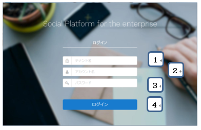
 
テナント名、アカウント名、パスワードを入力し、「ログイン」ボタンをクリックしてください。

| 番号 | 名称 | 説明 |
| -------- | -------- | -------- |
| 1   | テナント名    | テナント名を入力します。 |
| 2   | アカウント名  | アカウント名を入力します。|
| 3   | パスワード    | パスワードを入力します。|
| 4   | 「ログイン」ボタン | ログインを開始します。|

ログインするとダッシュボードが表示されます。

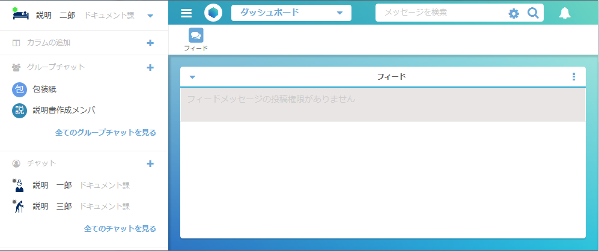

> :point_right: 初回ログイン時は、ダッシュボードを表示する前に「④　プロフィールを登録してみよう」のウィザード画面が表示されます。ウィザード画面が表示されない場合は、「3.2. チャットしてみよう」に進んでください。

④プロフィールを登録してみよう

ここでは、あなたのアバター画像、パスワードを設定し、チャットリストを作成します。

> :point_right: ここで説明するウィザード画面は、初回ログイン時のみ表示されます。２回目以降のログインでは表示されません。

1) プロフィールを登録しよう

アバター画像を登録できます。「参照」ボタンをクリックして、アバターとして登録したい画像ファイルを設定してください。

アバター画像に設定する画像ファイルを設定すると、アバター画像に設定する画像範囲を調整できます。「拡大」ボタン、「縮小」ボタンを使用して、適切な範囲に調整してください。適切な範囲に調整出来たら「ＯＫ」ボタンをクリックしてアバター画像を確定し、「次へ」ボタンをクリックします。

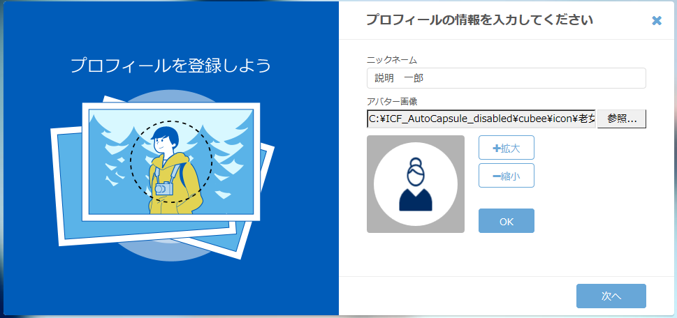

2) パスワードを設定しよう

初期パスワードを変更できます。「新しいパスワード」、「新しいパスワード（確認用）」を入力して、「次へ」ボタンをクリックしてください。

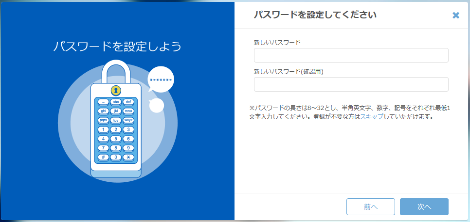

3)　チャットリストを作成しよう

チャットリストを作成できます。チャットリストに登録したいメンバーにチェックしてください。

>:point_right: 初期値としてあなたと同じ所属のメンバーが表示されています。その他のメンバーを登録したい場合は、検索ボックスにニックネームや組織名を入力し、検索してください。
>

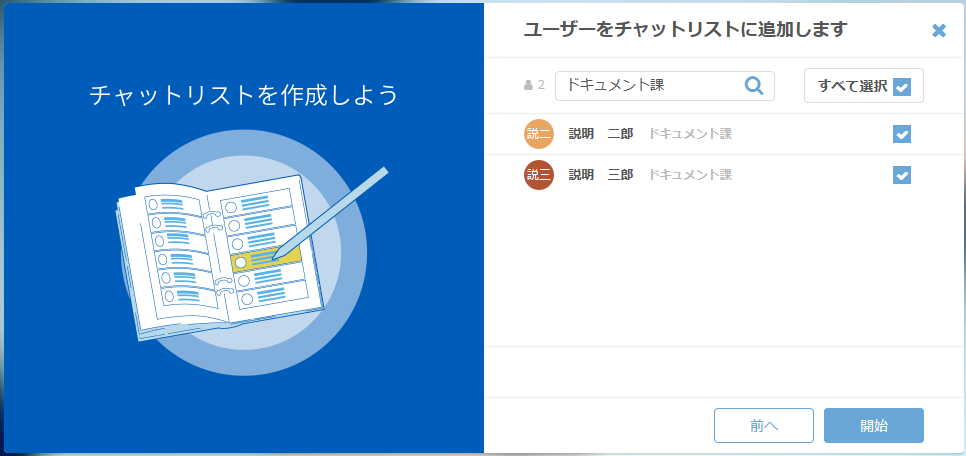

4)	「開始」ボタンをクリックするとダッシュボードが表示されます。

>:bulb: チャットリストにユーザを登録しておくと、１クリックでそのユーザとチャットする事ができます。

## 3.2.チャットしてみよう

チャットは1対1の会話です。他のメンバーには投稿内容は見えません。

①チャットするメンバーを選びましょう。

左サイドメニューのチャットには、「ログインしてみよう」で登録したメンバーが表示されています。チャットしたいメンバーをクリックするとチャットカラムが表示されます。

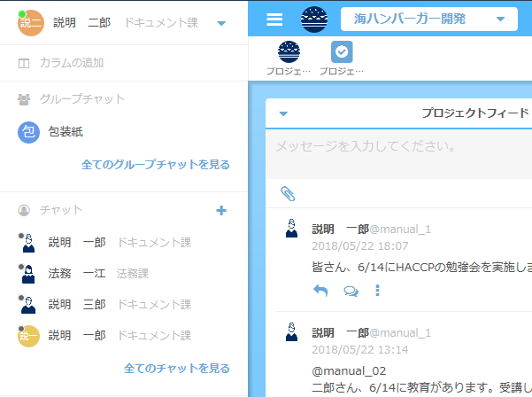

>:point_right: チャットしたいユーザがリストに表示されていない場合、「全てのチャットをみる」をクリックしてください。「チャットリスト」ダイアログが表示されます。このダイアログのユーザをクリックしても同様にチャットを始める事ができます。

②メッセージを投稿してみましょう

チャットカラムでメッセージを入力し、「投稿」ボタンをクリックするとメッセージが投稿されます。

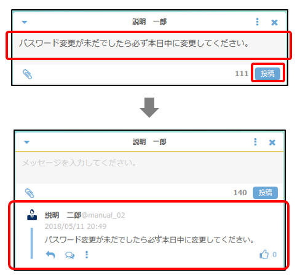

>:bulb: 企業向けソーシャルPFでは、140文字という短いメッセージのチャットで、効率的にコミュニケーションできます。また、既読機能や「いいね！」を利用すると１クリックでのコミュニケーションも可能です。
既読機能や「いいね！」の詳細は、以下を参照してください。
>
> + 4.5.6.　メッセージの既読を確認してみよう
>
> + 4.5.7.　「いいね！」してみよう

>:bulb: 新しく投稿したメッセージは、カラムの上部に表示します。

③チャットに返信してみましょう

返信したいメッセージの「返信します」ボタンをクリックすると返信メッセージを作成できます。メッセージを入力し、「返信」ボタンをクリックするとメッセージが返信されます。

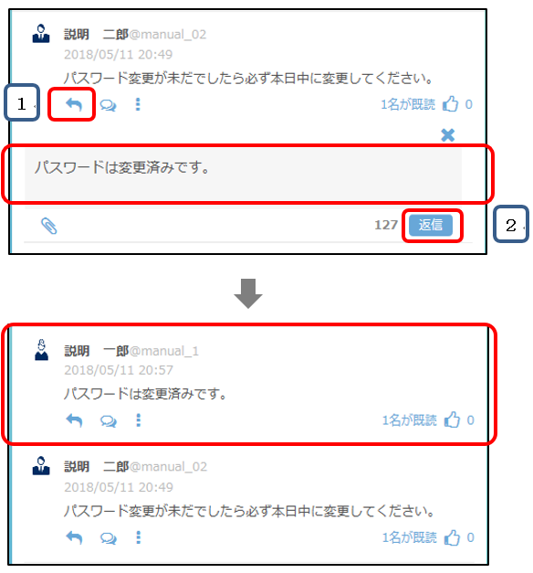

| 番号 | 名称 | 説明 |
| -------- | -------- | -------- |
| 1 | 「返信します」ボタン | そのメッセージの返信を作成できます。 |
| 2 | 「返信」ボタン | メッセージを返信します。 |

>:bulb: 返信メッセージは、以下の様に表示します。
>
>**チャット**：返信したメッセージをカラムの上部に表示
>
>**グループチャット・プロジェクトフィード**：投稿メッセージを親メッセージとし、返信メッセージをその下に表示
>
>※グループチャット、プロジェクトフィードについては、後述します。

## 3.3.グループでチャットしてみよう

グループチャットは、複数のメンバーでチャットできます。

①グループチャットを作ろう

左サイドメニューのグループチャットの「グループを追加」ボタンをクリックすると、「グループチャットの作成」ダイアログが表示されます。

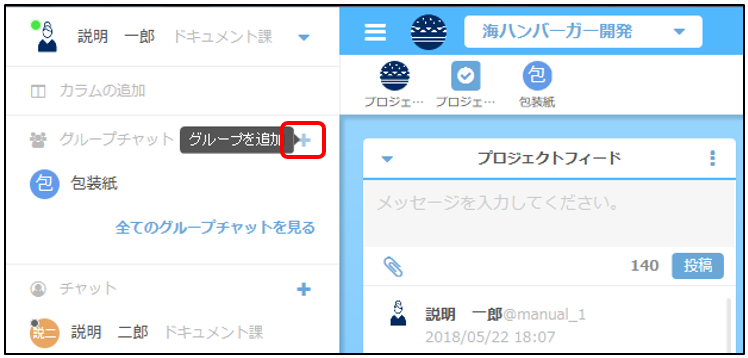

「グループチャットの作成」ダイアログに必要事項を記入し、「作成」ボタンをクリックするとグループチャットカラムが表示されます。

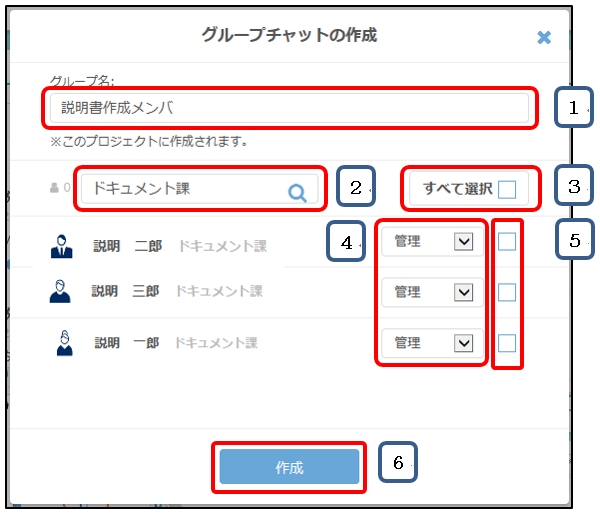

| 番号 | 名称 | 説明 |
| -------- | -------- | -------- |
| 1 | グループ名 | グループチャットの名称を設定します。 |
| 2 | 検索ボックス | グループチャットに参加するメンバーを検索するためのニックネームまたは組織名を設定します。「虫眼鏡」アイコンをクリックすると該当するメンバーの一覧を表示します。 |
| 3 | すべて選択／チェックボックス | 一覧に表示された全てのメンバーを選択します。もう一度クリックすると全ての選択を解除します。 |
| 4 | ユーザ権限リスト | メンバー毎にグループチャットを使用する際のユーザ権限を設定します。※別途リスト参照 |
| 5 | メンバー選択／チェックボックス | 一覧に表示されたメンバーを個別に選択します。|
| 6 | 「作成」ボタン | 設定した内容でグループチャットを作成します。 |

※ユーザ権限リスト

|  | 追加/退会/権限変更 | 投稿 | 閲覧 |
| -------- | :--------: | :--------: | :--------: |
| **管理** | 〇 | 〇 | 〇 |
| **投稿/閲覧** | － | 〇 | 〇 |
| **閲覧のみ** | － | － | 〇 |

②メッセージを投稿してみよう

>:point_right: 閲覧権限のメンバーは、メッセージの閲覧のみ可能です。
>
>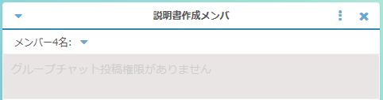

グループチャットカラムでメッセージを入力します。

「投稿」ボタンをクリックすると、メッセージが投稿されます。

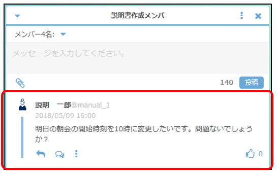

>:bulb: メッセージを投稿するとき、特定のメンバーに向けて発言をしたい場合にはメールのToに似たものとしてメンションを指定する事ができます。メンションを指定するとそのユーザの「自分宛」カラムに表示される様になり、気付きやすくなります。
詳しくは、「4.5.1.  メンションを指定してみよう」を参照してください。

>:bulb: メッセージを投稿する際、ファイルを添付する事ができます。
>
>詳しくは、「4.5.2.  メッセージにファイル添付してみよう」を参照してください。

③チャットに返信してみましょう

返信したいメッセージの「返信します」ボタンをクリックすると返信メッセージを作成できます。

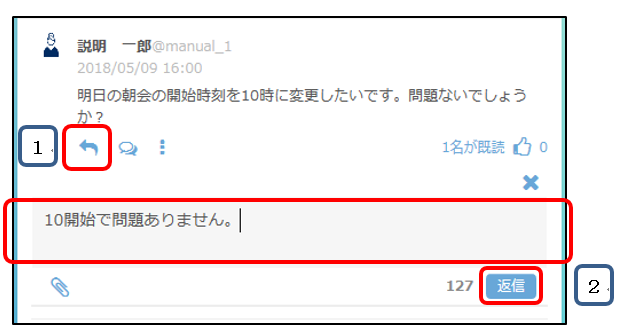

メッセージを入力し、「返信」ボタンをクリックするとメッセージが返信されます。

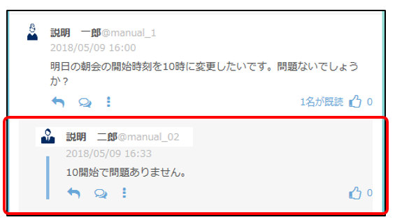

| 番号 | 名称 | 説明 |
| -------- | -------- | -------- |
| 1 | 「返信します」ボタン | そのメッセージの返信を作成できます。 |
| 2 | 「返信」ボタン | メッセージ入力領域に入力したメッセージを返信します。 |

④プルダウンメニューをみてみましょう

グループチャットカラム上部の「オプション」アイコンをクリックすると、プルダウンメニューを表示します。このプルダウンメニューからグループチャットに対する様々な操作を実行できます。

>:point_right: プルダウンメニューの内容は、ユーザ権限によって異なります。

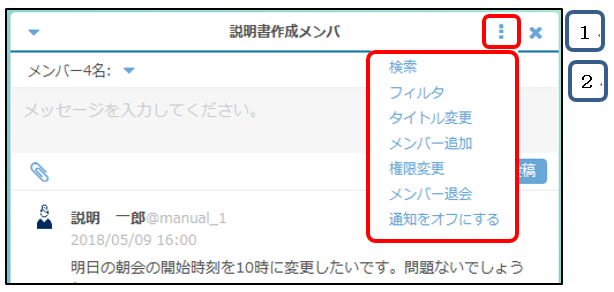

| 番号 | 名称 | 説明 |
| -------- | -------- | -------- |
| 1 | 「オプション」アイコン | プルダウンメニューを表示します。 |
| 2 | プルダウンメニュー | サブメニューを選択します。 |

サブメニューには、以下のメニューがあります。

| 番号 | 名称 | 説明 |
| -------- | -------- | -------- |
| 1 | 検索 | 任意のキーワードを含むメッセージを探します。 |
| 2 | フィルタ | 条件を指定してメッセージを抽出します。 |
| 3 | タイトル変更 | グループチャットのタイトルを変更します。 |
| 4 | メンバー追加 | グループチャットにメンバーを追加します。 |
| 5 | 権限変更 | グループチャットのメンバーの権限を変更します。 |
| 6 | メンバー退会 | グループチャットからメンバーを退会させます。 |
| 7 | 通知をオフにする | 他のメンバーからメッセージの投稿があった際の通知をオフします。 |
| 8 | メンバー確認 | グループチャットのメンバーを確認します。 |
| 9 | グループを退会 | グループチャットから退会します。 |

## 3.4.タスクを管理してみよう

タスクは、あなたが日々の業務でするべき作業を記録し、進捗状況を管理する事ができます。

①「マイタスク」カラムを開いてみましょう

自分のタスクを管理するカラムとして、マイタスクがあります。左サイドメニュー上部の「カラムを追加」アイコンをクリックします。

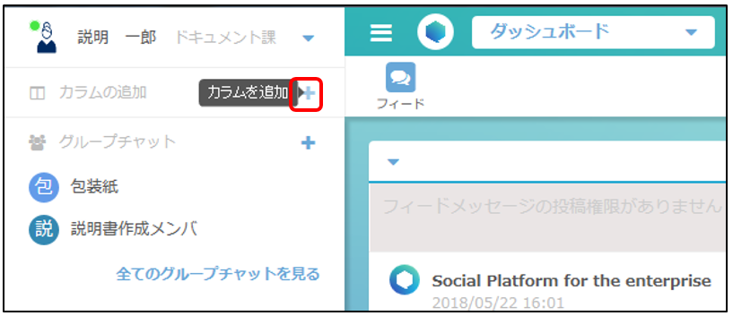

「カラム追加」ダイアログが開きます。「タスク」にチェックして、「追加」ボタンをクリックすると、「マイタスク」カラムが開きます。

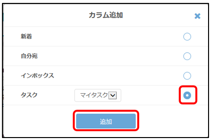

②タスクを登録してみましょう

「マイタスク」カラム上の「タスクを登録」ボタンをクリックすると、「タスクを登録」ダイアログが開きます。

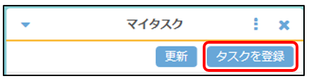

必要事項を記入して、「ＯＫ」ボタンをクリックします。

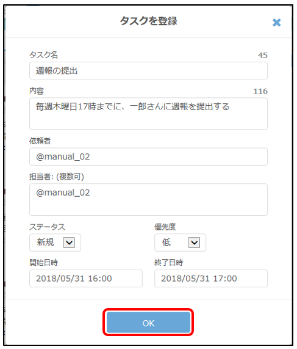

「マイタスク」カラムにタスクが登録されます。

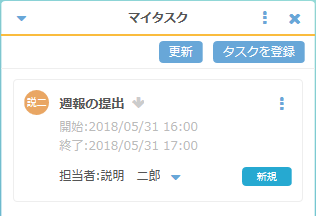

③ステータスを変更してみましょう

作業を開始したり、作業が終了したら、タスクのステータスを変更します。タスクの「オプション」アイコンをクリックすると、プルダウンメニューが開きます。

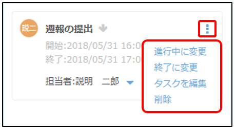

プルダウンメニューから、「進行中に変更」、または「終了に変更」をクリックし、ステータスを変更します。

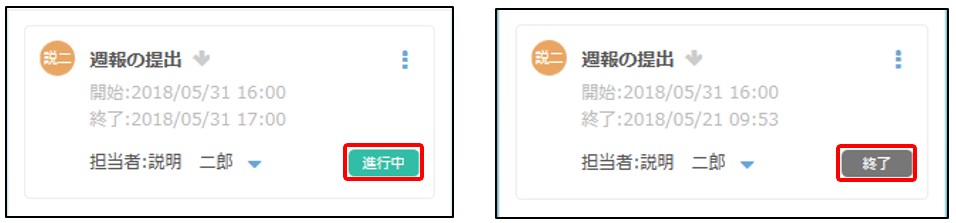

ステータスを終了にするとカラムに表示されなくなります。

>:point_right: マイタスクカラムには、タスクに設定した優先度、終了日時により以下の通り表示されます。
>
>①終了日時のステータス、優先度の組み合わせで、プロジェクトタスクに順に表示されます。
>
>②終了日時を超過、および終了日から３日前となったタスクは、以下のアラーム色で表示されます。

| 終了日時のステータス | アラーム色 |
| -------- | -------- |
| 終了日超過 | 赤色 |
| 終了日当日（終了時刻前） | 桃色 |
| 終了日から１～３日前 | 黄色 |
| 終了日から４日以上前 | アラーム無し |

>:point_right: 終了したタスクを参照したい場合は、カラム上部の「オプション」アイコンからフィルタを開きます。ステータスの終了にチェックし、「ＯＫ」ボタンをクリックすると終了したタスクを参照できます。

## 4.便利な使い方

## 4.1.ダッシュボードで操作してみよう

## 4.1.1.サイドメニューを縮小表示してみよう

サイドメニューを縮小表示し、ダッシュボードのカラム表示エリアを広げる事ができます。

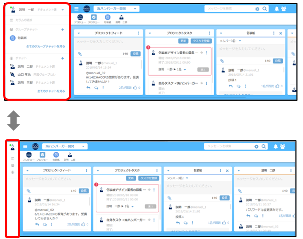

①サイドメニュー横の「メニュー」アイコンをクリックする毎に、サイドメニューの縮小表示、通常表示を切り替えます。

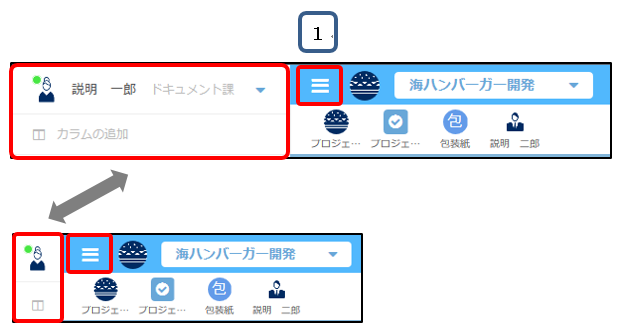

| 番号 | 名称 | 説明 |
| -------- | -------- | -------- |
| 1 | 「メニュー」アイコン | サイドメニューの縮小表示、通常表示を切り替えます。 |

## 4.1.2.ダッシュボードにカラムを追加してみよう

ダッシュボードは、新着、自分宛、インボックス、タスクの各カラムに加え、プロジェクトのプロジェクトフィード、プロジェクトタスクを表示する事ができます。
よく使うカラムをダッシュボードに表示すると、プロジェクトを切り替えずに複数のプロジェクトの情報を一画面で確認する事ができます。

①左サイドメニューからカラムを追加してみましょう

左サイドメニューの「カラムを追加」ボタンをクリックすると「カラムを追加」ダイアログが開きます。

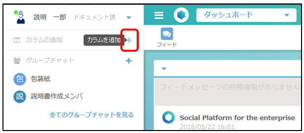

表示したいカラムを指定し、「追加」ボタンをクリックするとダッシュボードに表示されます。

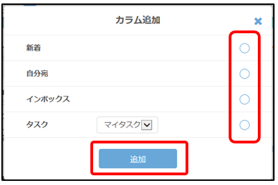

| 番号 | 名称 | 説明 |
| -------- | -------- | -------- |
| 1 | 新着 | 新たに到着したメッセージが表示されるカラムです。インボックス、マイタスク、チャット、グループチャット、プロジェクトフィード、プロジェクトタスクに到着した新着メッセージが表示されます。 |
| 2 | 自分宛 | 自分宛のメッセージおよびタスクを表示するカラムです。 |
| 3 | インボックス | 自分の作業を整理してタスクにする/しないを判断するカラムです。フィード、チャット、グループチャットから登録でき、また自分で直接登録もできます。他の人から依頼されたタスクが受付前の状態で表示されます。 |
| 4 | タスク | 自分のタスクを表示するカラムです。 |

②プロジェクトフィードからカラムを追加してみましょう

プロジェクトフィード、プロジェクトタスクの「オプション」アイコンをクリックすると表示されるプルダウンメニューから「ダッシュボードにカラムを追加」をクリックしてください。ダッシュボードにそのカラムが表示されます。

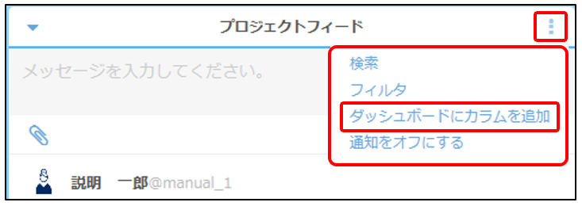

>:point_right: プロジェクトの詳細は、「4.2. プロジェクトを使ってみよう」を参照してください。

③カラムの表示順を変えてみましょう

ダッシュボードに表示したカラムは、ダッシュボード上部に「カラム」アイコンとして表示されています。また、「カラム」アイコンとカラムは、同じ並び順となっています。この「カラム」アイコンをドラッグ＆ドロップする事によりカラムの並び順を変更する事ができます。

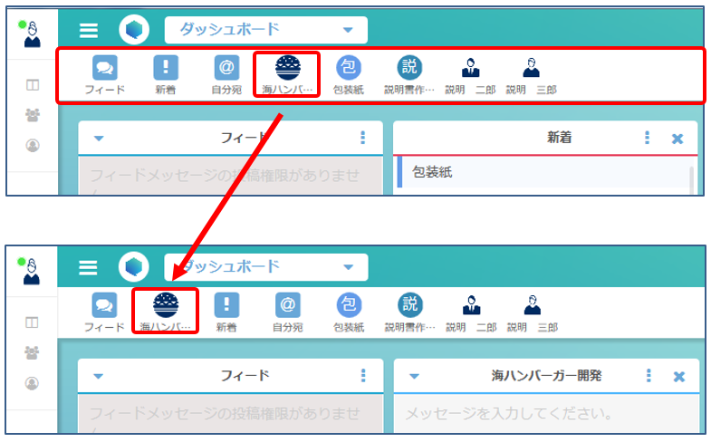

>:point_right: プロジェクトを開いている場合でも、同様に「カラム」アイコンをドラッグ＆ドロップする事でカラムの並び順を変更する事ができます。

## 4.1.3.メッセージを検索してみよう

①画面上部の検索ボックスを使うと複数のカラムからその文字列を含むメッセージを検索する事ができます。

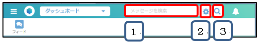

②検索する際に、あらかじめ検索するカラムを指定する事もできます。「ギア」アイコンをクリックすると表示される「検索オプション」ダイアログを設定して、検索してください。

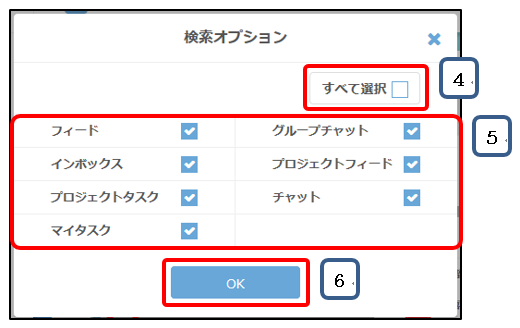

| 番号 | 名称 | 説明 |
| -------- | -------- | -------- |
| 1 | 検索ボックス | 検索するキーワードを入力します。 |
| 2 | 「ギア」アイコン | 「検索オプション」ダイアログを表示します。 |
| 3 | 「虫眼鏡」アイコン | 検索ボックスに入力したキーワードを含むメッセージを検索します。 |
| 4 | 「すべて選択」チェックボックス | チェックするとすべての「選択」チェックボックスを選択状態にします。チェックを外すとすべての「選択」チェックボックスを非選択状態にします。 |
| 5 | 「選択」チェックボックス | チェックしたカラム種別を検索の対象とします。 |
| 6 | 「ＯＫ」ボタン | 設定した内容で確定します。 |

>:bulb: メッセージは、カラム単位でも検索できます。この場合、カラム上部の「オプション」アイコンから検索をクリックしてください。「検索」ダイアログが開きます。
>
>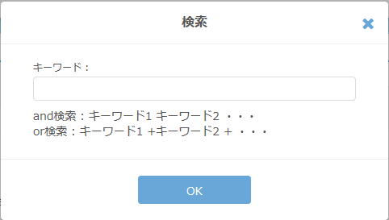

## 4.1.4.受信したメッセージを確認してみよう

①　いずれかのカラム名をクリックしてください。そのカラムを表示します。

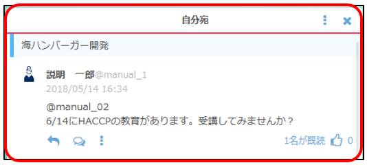

>:point_right: カラム上部の「オプション」アイコンで表示されるプルダウンメニューから「通知をオフにする」をクリックするとそのカラムのメッセージ受信のお知らせを抑制する事ができます。
>
>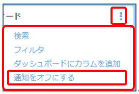

## 4.1.5.新着、自分宛でメッセージを確認してみよう

新着カラム、または自分宛カラムを利用すると、様々なカラムに投稿されたメッセージを１つのカラムで時系列に確認する事ができます。
メッセージには、カラム名称が表示されており、どのカラムのメッセージかを確認する事ができます。

| カラム | 説明 |
| -------- | -------- |
| 新着 | 新たに到着したメッセージが表示されるカラムです。インボックス、マイタスク、チャット、グループチャット、プロジェクトフィード、プロジェクトタスクに到着した新着メッセージが表示されます。 |
| 自分宛 | 自分宛のメッセージおよびタスクを表示するカラムです。チャットや自分宛にメンションされたグループチャット、プロジェクトフィードのメッセージをまとめて確認する事ができます。 |

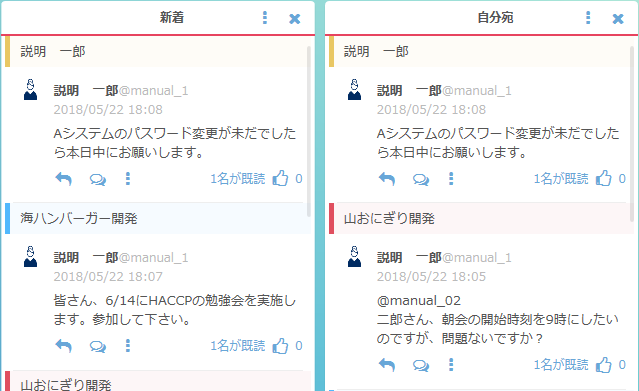

## 4.2.プロジェクトを使ってみよう

プロジェクトは、特定の目的を持った集団、および運営が必要な集団がコミュニケーションをとる場所です。プロジェクトに所属するメンバー全員でメッセージやタスクを共有します。

## 4.2.1.プロジェクトを作ってみよう

「プロジェクトを選択」をクリックすると、プルダウンメニューが開きます。プルダウンメニューから「プロジェクトの作成」をクリックすると「プロジェクト作成」ダイアログが開きます。

>:point_right: ①プロジェクトを作成すると、「プロジェクトを選択」にそのプロジェクトが表示されます。

> ②この「プロジェクトを選択」からダッシュボード、またはプロジェクトの画面を切り替える事ができます。

「プロジェクト作成」ダイアログの各項目を入力して、「作成」ボタンをクリックすると、プロジェクトが作成されます。

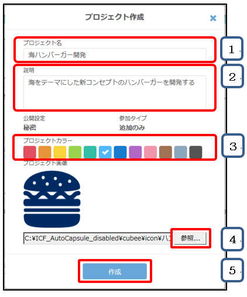

| 番号 | 名称 | 説明 |
| -------- | -------- | -------- |
| 1 | プロジェクト名 | プロジェクト名を入力します。 |
| 2 | 説明 | プロジェクトの説明を入力します。 |
| 3 | プロジェクトカラー | プロジェクトカラーを指定します。 |
| 4 | 「参照」ボタン | プロジェクト画像に設定する画像ファイルを設定します。 |
| 5 | 「作成」ボタン | プロジェクトを作成します。 |

>:bulb: プロジェクトに、プロジェクトカラーを設定する事ができます。このプロジェクトカラーは、プロジェクトを開いた画面の背景色となり、どのプロジェクトを開いているのかを視覚的に判断する事ができます。

## 4.2.2.プロジェクトにメンバーを登録してみよう

「プロジェクト詳細」アイコンをクリックすると、右サイドメニューが開きます。

右サイドメニューの「ギア」アイコンをクリックすると、プルダウンメニューが開きます。

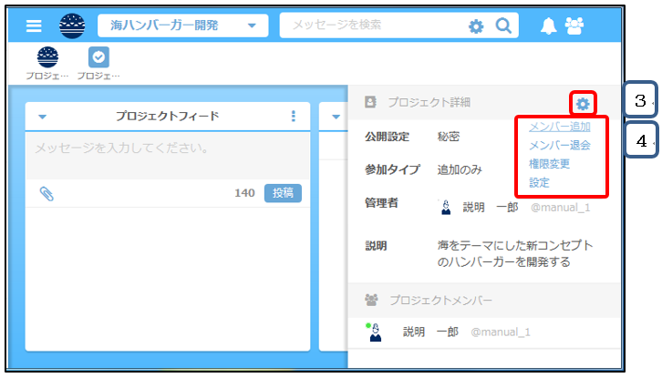

| 番号 | 名称 | 説明 |
| -------- | -------- | -------- |
| 1 | 「プロジェクト詳細」アイコン | プロジェクトの右サイドメニューを開きます。 |
| 2 | 右サイドメニュー | プロジェクト詳細、プロジェクトメンバーを表示します。 |
| 3 | 「ギア」アイコン | プルダウンメニューを開きます。 |
| 4 | プルダウンメニュー | サブメニューを選択し、プロジェクトをメンテナンスします。 |

このプルダウンメニューから「メンバー追加」をクリックすると、「メンバーの追加」ダイアログが開きます。必要なメンバーを選択し、「追加」ボタンをクリックするとプロジェクトにメンバーが追加されます。

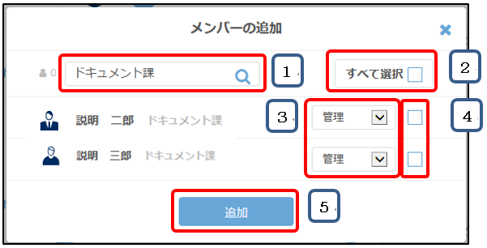

| 番号 | 名称 | 説明 |
| -------- | -------- | -------- |
| 1 | 検索ボックス | プロジェクトに参加するメンバーを検索するためのニックネームまたは組織名を設定します。「虫眼鏡」アイコンをクリックすると該当するメンバーの一覧を表示します。|
| 2 | すべて選択チェックボックス | 一覧に表示された全てのメンバーを選択します。もう一度クリックすると全ての選択を解除します。 |
| 3 | ユーザ権限リスト | メンバー毎にプロジェクトを使用する際のユーザ権限を設定します。※別途リスト参照 |
| 4 | メンバー選択チェックボックス | 一覧に表示されたメンバーを個別に選択します。 |
| 5 | 「追加」ボタン | 設定した内容でメンバーを追加します。 |

ユーザ権限リスト

|  | 追加/退会/権限変更 | 投稿 | 閲覧 |
| -------- | :--------: | :--------: | :--------: |
| **管理** | 〇 | 〇 | 〇 |
| **投稿/閲覧** | － | 〇 | 〇 |
| **閲覧のみ** | － | － | 〇 |

## 4.2.3.プロジェクトフィードでチャットしてみよう

>:point_right:  閲覧権限のメンバーは、メッセージの閲覧のみ可能です。
>
>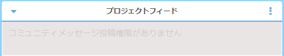

プロジェクトフィードでメッセージを入力します。

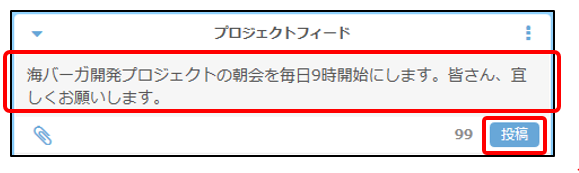

「投稿」ボタンをクリックするとメッセージが投稿されます。

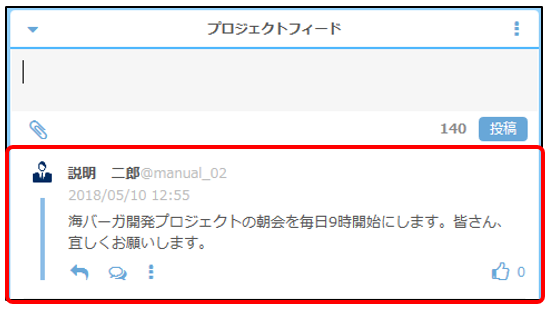

チャットに返信する場合は、返信したいメッセージの「返信します」ボタンをクリックすると返信メッセージを作成できます。

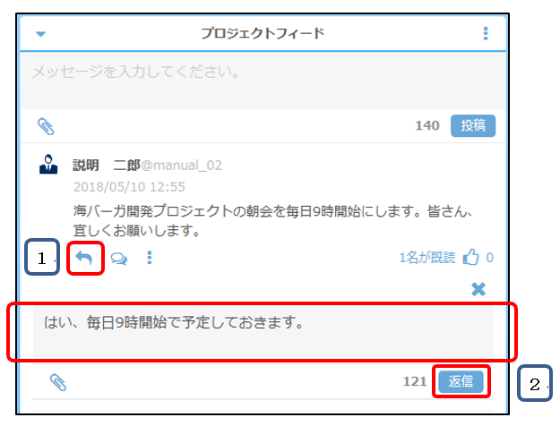

メッセージを入力し、「返信」ボタンをクリックするとメッセージが返信されます。

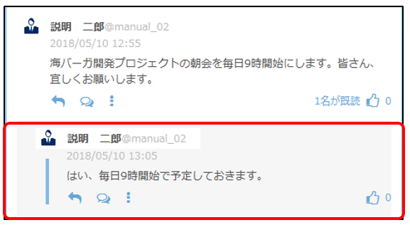

| 番号 | 名称 | 説明 |
| -------- | -------- | -------- |
| 1 | 「返信します」ボタン | 返信メッセージ入力領域を表示します。 |
| 2 | 「返信」ボタン | メッセージ入力領域に入力したメッセージを返信します。 |

## 4.2.4.プロジェクトのグループチャットを作ってみよう

プロジェクトフィードとは別に、プロジェクトのグループチャットを作成し、チャットする事ができます。これは、プロジェクトの一部のメンバーでチャットしたい場合や、プロジェクトの中でも目的や話題によって議論する場を分けたい場合に利用できます。

>:point_right: プロジェクトのグループチャットは、管理者権限を持ったメンバーが作成できます。

まず、グループチャットを作成したいプロジェクトを開きます。
「プロジェクトを選択」をクリックし、プルダウンメニューを表示します。表示されたプルダウンメニューからグループチャットを作成したいプロジェクトをクリックします。

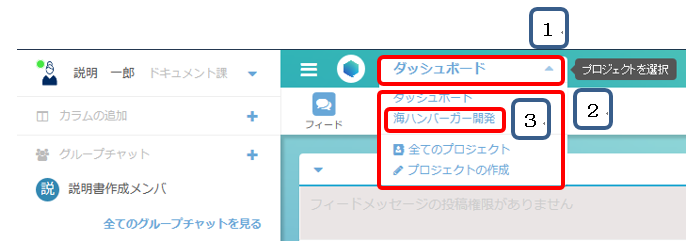

左サイドメニューのグループチャットで「グループを追加」をクリックすると、「グループチャットの作成」ダイアログが開きます。

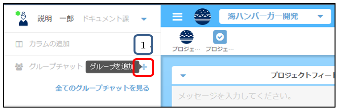

「グループチャットの作成」ダイアログに必要事項を記入し、「作成」ボタンをクリックするとグループチャットカラムが表示されます。

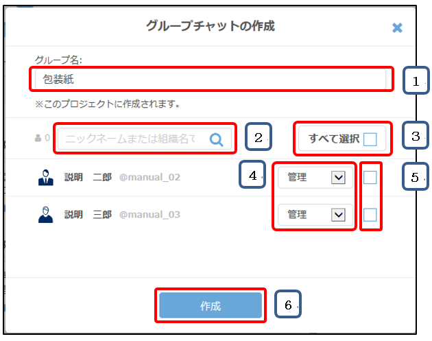

| 番号 | 名称 | 説明|
| -------- | -------- | -------- |
| 1 | グループ名 | グループチャットの名称を設定します。 |
| 2 | 検索ボックス | グループチャットに参加するメンバーを検索するためのニックネームまたは組織名を設定します。「虫眼鏡」アイコンをクリックすると該当するメンバーの一覧を表示します。 |
| 3 | すべて選択チェックボックス | 一覧に表示された全てのメンバーを選択します。もう一度クリックすると全ての選択を解除します。 |
| 4 | ユーザ権限リスト | メンバー毎にグループチャットを使用する際のユーザ権限を設定します。※別途リスト参照 |
| 5 | メンバー選択チェックボックス | 一覧に表示されたメンバーを個別に選択します。 |
| 6 | 「作成」ボタン | 設定した内容でグループチャットを作成します。 |

ユーザ権限リスト

|  | 追加/退会/権限変更 | 投稿 | 閲覧 |
| -------- | :--------: | :--------: | :--------: |
| **管理** | 〇 | 〇 | 〇 |
| **投稿/閲覧** | － | 〇 | 〇 |
| **閲覧のみ** | － | － | 〇 |

>:point_right: プロジェクトのグループチャットには、プロジェクトのメンバー以外を参加させる事ができます。

## 4.2.5.プロジェクトでタスクを依頼してみよう

プロジェクトのタスクは、プロジェクトで共有すべき作業を記録し、進捗状況を管理する事ができます。
他の人に作業を依頼するフローは、以下のようになります。

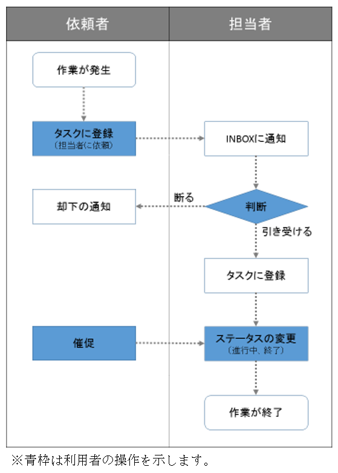

①タスクを依頼してみよう

「タスクを登録」ボタンからタスクを登録してみましょう。

プロジェクトタスクから「タスクを登録」ボタンをクリックすると、「タスクを登録」ダイアログが開きます。

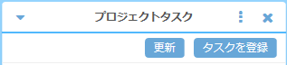

「タスクを登録」ダイアログの各項目を入力して、「ＯＫ」ボタンをクリックすると、タスクが登録されます。

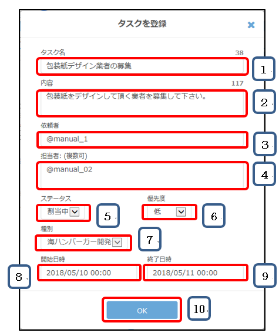

| 番号 | 名称| 説明 |
| -------- | -------- | -------- |
| 1 | タスク名 | タスク名を入力します。 |
| 2 | 内容 | タスクの内容を入力します。 |
| 3 | 依頼者 | タスクの依頼者を入力します。 |
| 4 | 担当者 | タスクの担当者を入力します。 |
| 5 | ステータス | タスクのステータスを設定します。担当者を入力すると割り当て中に設定されます。 |
| 6 | 優先度 | タスクの優先度を設定します。 |
| 7 | 種別 | タスクの種別を設定します。 |
| 8 | 開始日時 | タスクの開始日時を設定します。 |
| 9 | 終了日時 | タスクの終了日時を設定します。 |
| 10 | 「ＯＫ」ボタン | タスクを登録します。 |

>:point_right: プロジェクトタスクカラムには、タスクに設定した優先度、終了日時により以下の通り表示されます。
>
>①終了日時のステータス、優先度の組み合わせで、プロジェクトタスクに順に表示されます。
>
>②終了日時を超過、および終了日から３日前となったタスクは、以下のアラーム色で表示されます。

| 終了日時のステータス | アラーム色 |
| -------- | -------- |
| 終了日超過 | 赤色 |
| 終了日当日（終了時刻前） | 桃色 |
| 終了日から１～３日前 | 黄色 |
| 終了日から４日以上前 | アラーム無し |

②自分に依頼されたタスクを引き受けるか、断るかを決めよう

自分に依頼されたタスクは、インボックスに登録されています。ダッシュボードのインボックスを開いてください。

>:point_right: ダッシュボードにインボックスが表示されていない場合は、以下の操作で開きます。
>
>①左サイドメニューの「カラムを追加」から「カラム追加」ダイアログを開きます。
>
>②インボックスを選択し、「追加」ボタンをクリックします。
>
>③ダッシュボードにインボックスが表示されます。

インボックスに追加されているタスクの「オプション」アイコンをクリックし、プルダウンメニューを開いてください。「依頼を引き受ける」、「依頼を断る」のいずれかを選択してクリックしてください。

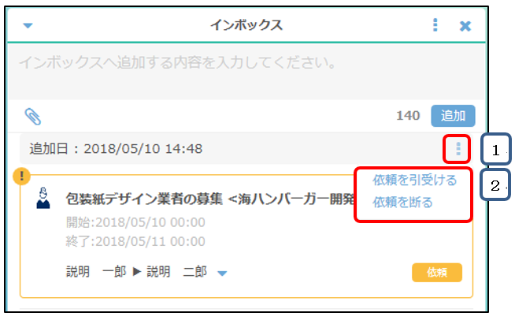

| 番号| 名称 | 説明 |
| -------- | -------- | -------- |
| 1 | 「オプション」アイコン | プルダウンメニューを表示します。 |
| 2 | プルダウンメニュー | 依頼を引き受けるか、断るかを選択できます。 |

「依頼を引き受ける」と、マイタスクにタスクが表示されます。

タスクの「オプション」アイコンをクリックするとプルダウンメニューが表示されます。
プルダウンメニューからタスクの進捗状況を変更してください。

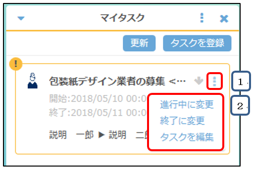

| 番号| 名称 | 説明 |
| -------- | -------- | -------- |
| 1 | 「オプション」アイコン | プルダウンメニューを開きます。 |
| 2 | プルダウンメニュー | タスクのステータス変更や編集ができます。 |

「依頼を断る」と、タスクの依頼者に却下した事が通知されます。

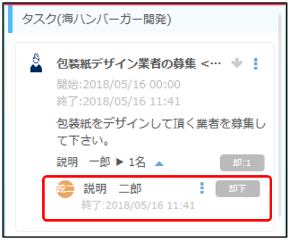

③タスクを催促してみよう

依頼中のタスクの進捗が芳しくない場合など、担当者へ催促する事ができます。

催促したいタスクの「オプション」アイコンをクリックし、プルダウンメニューを表示します。プルダウンメニューから催促をクリックします。

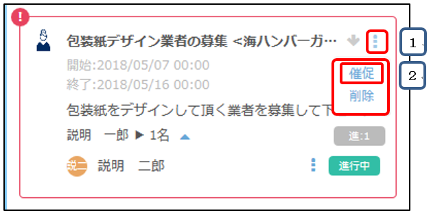

催促されたタスクは、ステータス表示と交互に「急いで」と表示されます。

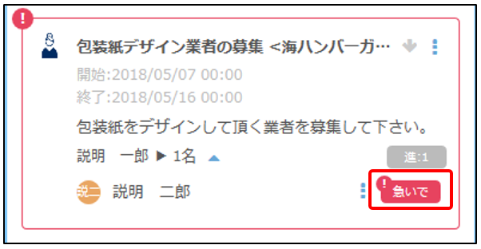

## 4.2.6.プロジェクトを切り替えてみよう

企業向けソーシャルPFでは、複数のプロジェクトに参加できます。複数のプロジェクトに参加している場合、プロジェクトを切り替えて利用する事ができます。

①「プロジェクトを選択」をクリックすると、プルダウンメニューが開きます。プルダウンメニューから参照したいプロジェクトをクリックすると、そのプロジェクトを開きます。

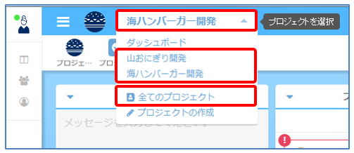

>:point_right: プルダウンメニューから「全てのプロジェクト」をクリックすると、「プロジェクトリスト」ダイアログが開きます。このダイアログからプロジェクトを選択する事でもプロジェクトを開く事ができます。
>
>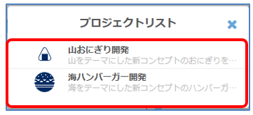

## 4.2.7.プロジェクトをメンテナンスしてみよう

「プロジェクト詳細」アイコンをクリックすると、右サイドメニューが開きます。右サイドメニューから「プロジェクト詳細」の「ギア」アイコンをクリックするとプルダウンメニューが表示されます。このプルダウンメニューからメンバーの追加/退会、権限変更、プロジェクト設定の変更を行う事ができます。

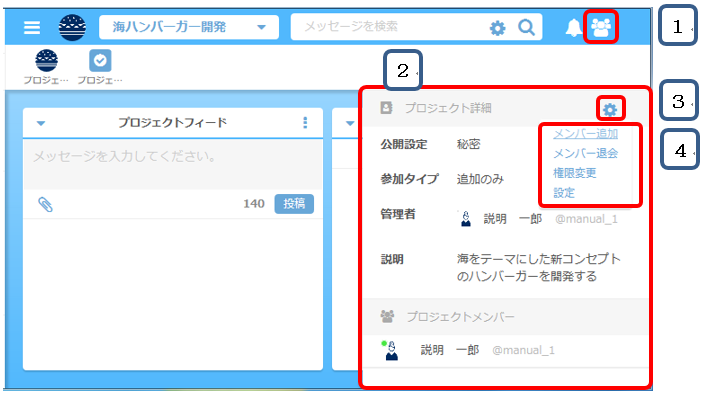

| 番号 | 名称 | 説明|
| -------- | -------- | -------- |
| 1 | 「プロジェクト詳細」アイコン | 右サイドメニューを開きます。 |
| 2 | 右サイドメニュー | プロジェクト詳細、プロジェクトメンバーを参照できます。 |
| 3 | 「ギア」アイコン | プルダウンメニューを開きます。 |
| 4 | プルダウンメニュー | サブメニューを開きます。 |

## 4.3.サイドメニューを操作してみよう

## 4.3.1.プロフィールを設定してみよう

①左サイドメニューの最上段にあるアカウント設定をクリックすると、サブメニューが表示されます。サブメニューのプロフィール設定をクリックして、「プロフィール変更」ダイアログを表示してください。

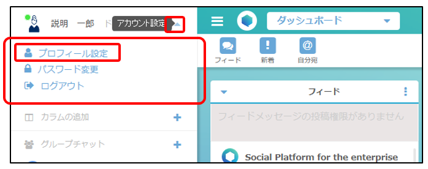

②「プロフィール変更」ダイアログでニックネーム、メールアドレス、ステータス、ひとことメモ、アバター画像を設定してください。

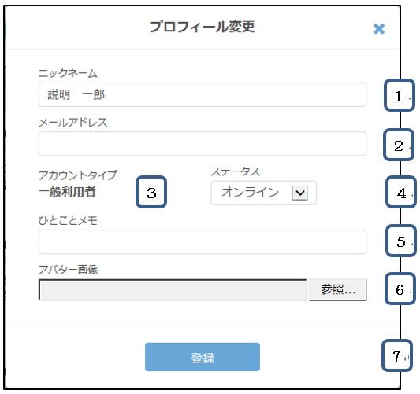

| 番号 | 名称 | 説明 |
| -------- | -------- | -------- |
| 1 | ニックネーム | ニックネームを設定します。 |
| 2 | メールアドレス | メールアドレスを設定します。 |
| 3 | アカウントタイプ | あなたのアカウントのタイプが表示されます。  　一般利用者／管理者 |
| 4 | ステータス | ステータス（在席情報）を設定します。　  オンライン／退席中／外出・出張中／取り込み中 |
| 5 | ひとことメモ | ひとことメモを設定します。 |
| 6 | 「参照」ボタン | アバター画像に設定する画像ファイルを設定します。 |
| 7 | 「登録」ボタン | 設定した内容を登録します。 |

>:point_right: ①「ひとことメモ」には、予定など任意の情報を記載できます。
>
>②ステータスやひとことメモに設定した内容は、メッセージ中のアバターにポイントすると表示されるバルーンウインドウで他のメンバーと共有できます。
>
>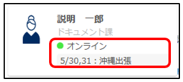

③アバター画像に設定する画像ファイルを設定すると、アバター画像に設定する画像範囲を設定できます。「拡大」ボタン、「縮小」ボタンを使用して、適切な範囲を設定してください。適切な範囲が設定出来たら「ＯＫ」ボタンをクリックしてアバター画像を確定します。

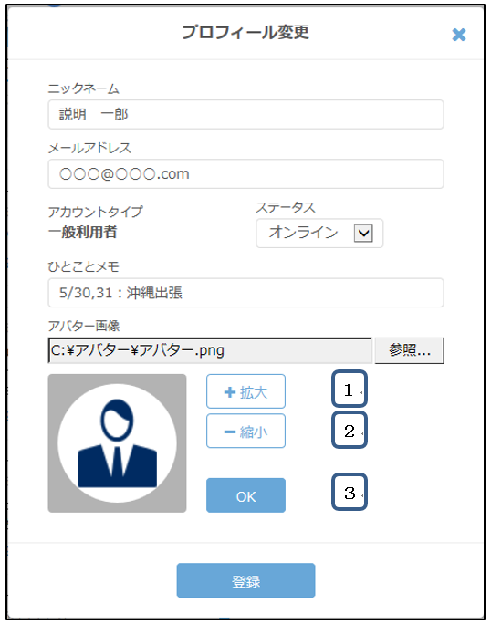

| 番号 | 名称 | 説明 |
| -------- | -------- | -------- |
| 1 | 「拡大」ボタン | 設定するアバター画像を拡大します。 |
| 2 | 「縮小」ボタン | 設定するアバター画像を縮小します。 |
| 3 | 「ＯＫ」ボタン | 設定するアバター画像を確定します。 |

④更新したい項目の設定が終わったら「登録」ボタンをクリックして、プロフィールを更新してください。

## 4.3.2.パスワードを変更してみよう

①左サイドメニューの最上段にあるアカウント設定をクリックすると、サブメニューが表示されます。サブメニューのパスワード変更をクリックして、「パスワード変更」ダイアログを表示してください。

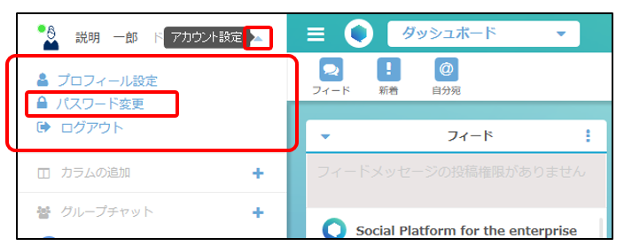

②「パスワード変更」ダイアログで、現在のパスワード、新しいパスワードを入力し、「登録」ボタンをクリックしてください。

## 4.3.3.ログアウトしてみよう

①左サイドメニューの最上段にあるアカウント設定をクリックすると、サブメニューが表示されます。サブメニューのログアウトをクリックすると、ログアウトします。

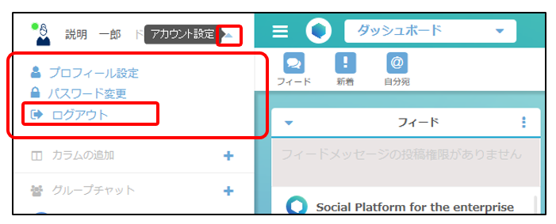

>:point_right: ログアウトせずにWebブラウザを終了した場合、再度「企業向けソーシャルPF」の接続先URLにアクセスすると自動的にログインします。

## 4.3.4.チャットリストにメンバーを追加してみよう

左サイドメニューのチャットにユーザを登録しておくと、そのユーザと簡単にチャットする事ができます。

①左サイドメニューのチャットの「ユーザを追加」アイコンをクリックし、「ユーザの選択」ダイアログを表示します。

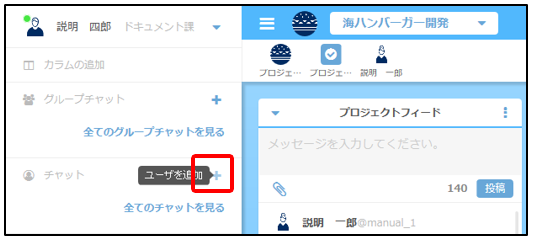

②「ユーザの選択」ダイアログでは、ニックネーム又は組織名からユーザを検索できます。チャットリストに追加したいユーザを選択し、「追加」ボタンをクリックしてください。

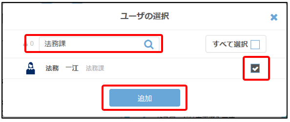

③チャットリストに追加したユーザが表示されます。

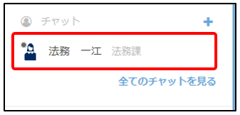

## 4.4.カラムを操作してみよう

## 4.4.1.投稿領域を閉じてみよう

参照専用で利用したいカラムへのメッセージの誤投稿を防ぎたいなどの目的で、投稿領域を閉じる事ができます。カラム上部の「投稿領域の開閉」アイコンをクリックする度に投稿領域の開閉を切り替えます。

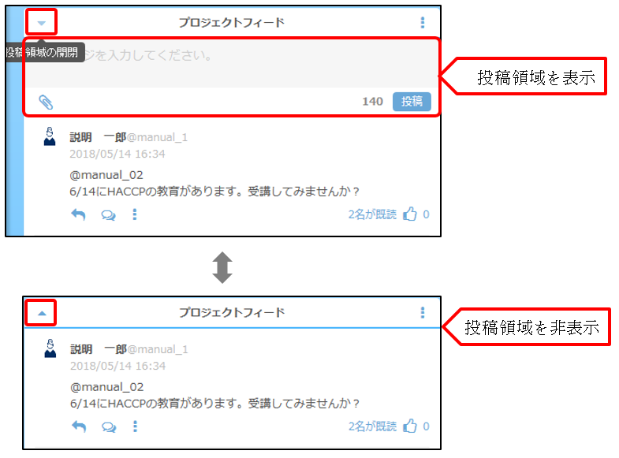

## 4.4.2メッセージをフィルタしてみよう

カラムに投稿されているメッセージを指定した条件に該当するものに絞り、別カラムに表示できます。

①カラム上部の「オプション」アイコンをクリックし、プルダウンメニューを開きます。プルダウンメニューの「フィルタ」をクリックすると、「フィルタ」ダイアログが開きます。

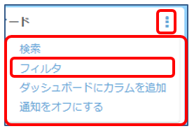

②「フィルタ」ダイアログで条件を設定し、「ＯＫ」ボタンをクリックすると、新しいカラムを開き、フィルタされたメッセージが表示されます。

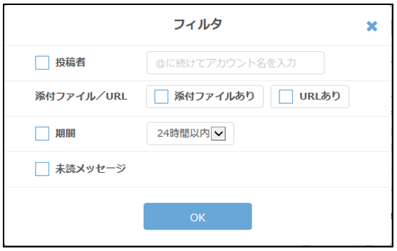

## 4.4.3.タスクをフィルタしてみよう

カラムに登録されているタスクを指定した条件に該当するものに絞り、別カラムに表示できます。

①カラム上部の「オプション」アイコンをクリックし、プルダウンメニューを開きます。プルダウンメニューの「フィルタ」をクリックすると、「フィルタ」ダイアログが開きます。

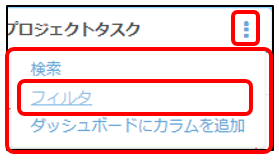

②「フィルタ」ダイアログで条件を設定し、「ＯＫ」ボタンをクリックすると、新しいカラムを開き、フィルタされたタスクが表示されます。

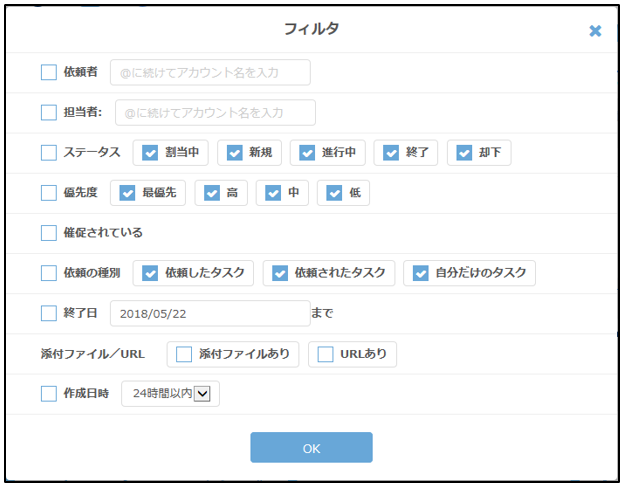

## 4.5.メッセージを操作してみよう

## 4.5.1.メンションを指定してみよう

プロジェクトフィードやグループチャットにメッセージを投稿するとき、特定のメンバーに向けて発言をしたい場合にはメールのToに似たものとしてメンションを指定する事ができます。メンションを指定するとそのユーザの「自分宛」カラムに表示される様になり、気付きやすくなります。

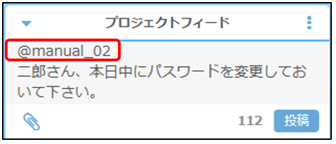

>:point_right: ①	メンションは「’@’＋ ユーザID」の形式です。
>
>②	メッセージ入力時に1バイト文字を連続2文字以上入力するとそのカラムに該当するユーザIDのメンバーがいる場合、そのメンションが自動表示されます。その表示から該当するメンションを選択する事でメッセージ中にメンションを入力する事ができます。
>
> 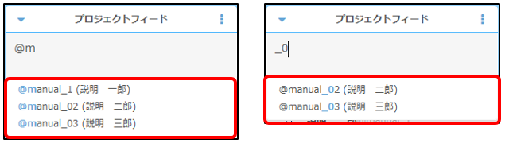

## 4.5.2.メッセージにファイル添付してみよう

メッセージを投稿する際、ファイルを添付する事ができます。

①投稿領域の「クリップ」アイコンをクリックすると、メッセージにファイルを添付できます。

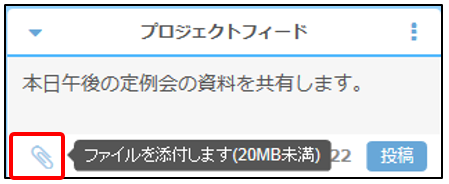

②選択したファイルが誤っていた場合、「キャンセル」アイコンをクリックするとキャンセルできます。

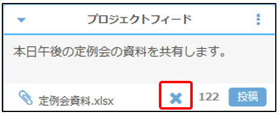

③投稿したメッセージに表示されているファイル名をクリックするとファイルを参照できます。

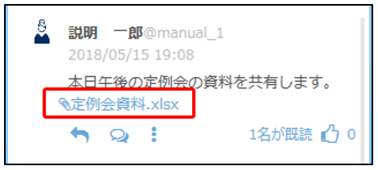

>:point_right:
>
>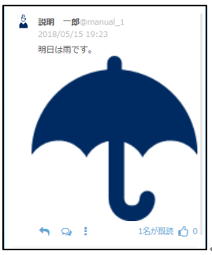

## 4.5.3.メッセージを削除してみよう

投稿したメッセージの内容が誤っていた場合など、投稿済みメッセージを削除する事ができます。

①削除したいメッセージの「オプション」アイコンをクリックし、プルダウンメニューを表示します。プルダウンメニューから、「削除」をクリックすると、「削除」ダイアログを開きます。

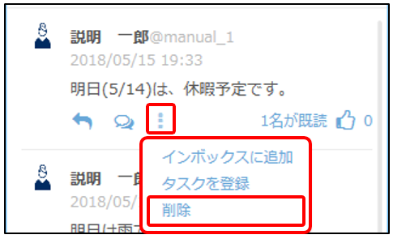

②「削除」ダイアログで「ＯＫ」ボタンをクリックします。

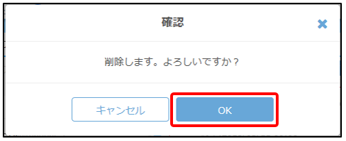

③メッセージが削除されます。

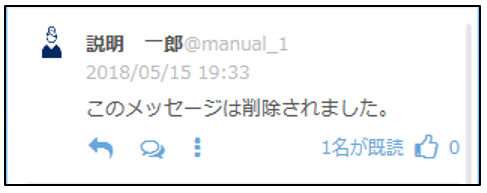

## 4.5.4.メッセージからタスクを登録してみよう

①タスクに登録したいメッセージの「オプション」アイコンをクリックし、プルダウンメニューを表示します。プルダウンメニューから、「タスクを登録」をクリックすると、「タスクを登録」ダイアログが開きます。

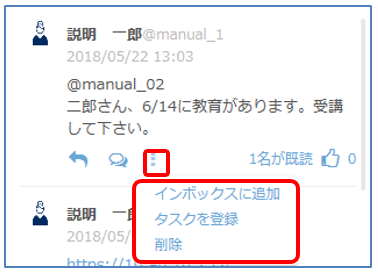

②「タスクを登録」ダイアログで各項目を記載、又は修正し、「ＯＫ」ボタンをクリックするとタスクとして登録されます。

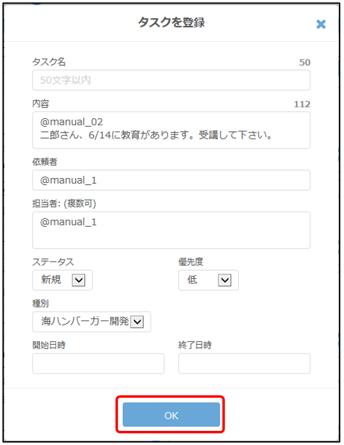

## 4.5.5.アバターからチャットを始めてみよう

プロジェクトフィードやグループチャットに投稿されたメッセージを見て、その投稿者とチャットを始める事ができます。

①投稿されたメッセージのアバターをダブルクリックすると、そのメンバーとのチャットカラムが表示されます。

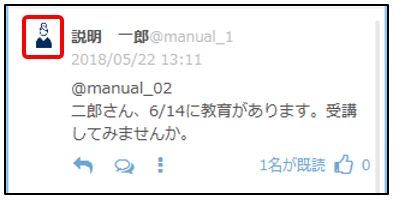

## 4.5.6.メッセージの既読を確認しよう

メッセージには未既/既読の状態があります。メッセージを既読にすることで、相手にそのメッセージを見た事を伝えたり、誰がそのメッセージを見ているのかを確認することができます。

①新たに投稿されたメッセージは、メッセージの左側に青いラインが表示されています。この状態が未読となります。

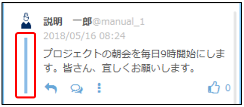

②未読のメッセージをクリックすると青いラインが消えます。この状態が既読となり、他のメンバーにこのメッセージを読んだ事を示す事ができます。

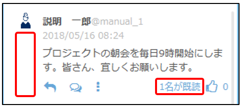

③メッセージ下部の「○名が既読」をクリックすると「既読者一覧」ダイアログが開き、既読のメンバーを確認できます。

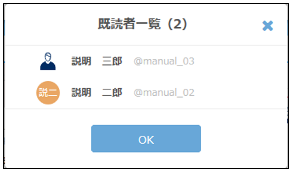

>:point_right: ダッシュボードのフィードでは、メッセージ下部の「○名が既読」の部分が「既読者一覧」となります。

## 4.5.7.「いいね！」してみよう

「いいね！」]は、相手のメッセージに共感した時や、やり取りの中で返信をするまでもなく相手のメッセージに合意を伝えたい時に利用します。

①「いいね！」をするには、メッセージの下部の「いいね！」アイコンをクリックします。

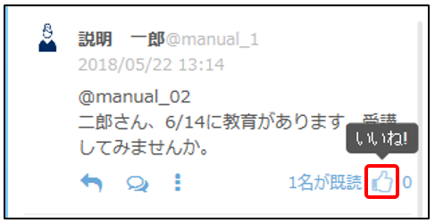

②「いいね！」をするとアイコン横のカウントが増えます。

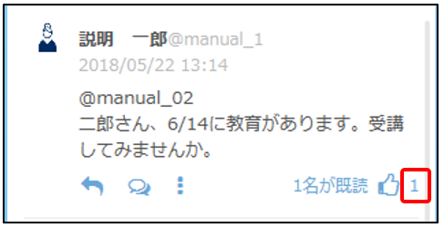

③カウントをクリックすると、「いいね！」ダイアログが開き、「いいね！」したメンバーを確認する事ができます。

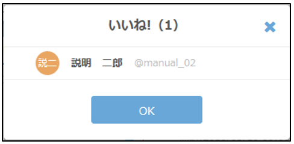

## 5.  追加機能リスト

## 5.1. 5.0.1_ajh_1

①	チャットリストのメンバーを削除することができます。

左サイドメニューのチャットの「ユーザを削除」アイコンをクリックし、「チャットリストから削除」ダイアログを表示。

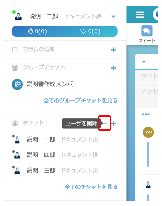

「チャットリストから削除」ダイアログでは、ニックネーム又はアカウント名からユーザを検索できます。チャットリストに削除したいユーザを選択し、「削除」ボタンをクリックしてください。

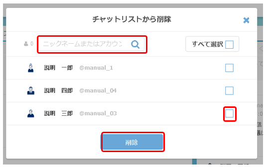

チャットリストから削除したユーザが消えているのを確認します。

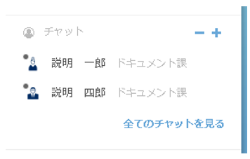

## 5.2.  5.0.2_ajh

①	メッセージ(スレッド単位)にタイトルを付与することができます。

タイトルを入力して、メッセージを「投稿」ボタンをクリックします。

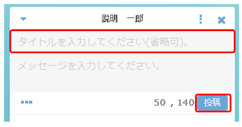

タイトル付きのメッセージが投稿されます。

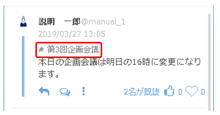

②	ルーム上へ設定されたタイトルの一覧を取得することができます。

カラム上部の「オプション」アイコンをクリックし、プルダウンメニューを開いて、プルダウンメニューの「タイトル一覧」をクリックします。「タイトル一覧」ダイアログが開きます

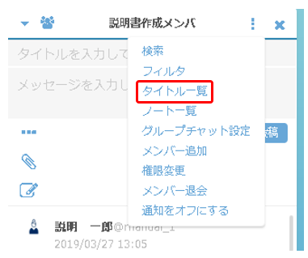

「タイトル一覧」ダイアログが開き、取得したいタイトルを選択します。

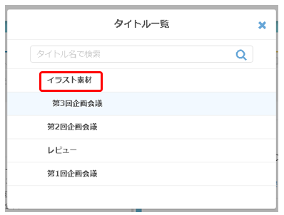

選択したタイトルのチャットが表示されます。

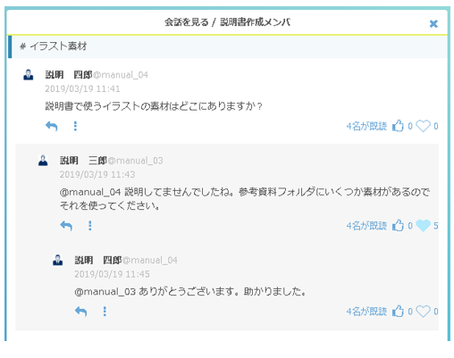

③	投稿したメッセージを編集することができます。（編集後、既読情報はリセットされます）

編集したいメッセージの「オプション」アイコンをクリックし、プルダウンメニューを表示します。
プルダウンメニューから、「メッセージ編集」をクリックします。

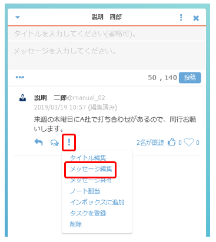

「メッセージ編集」ダイアログでメッセージの内容を編集して、「ＯＫ」ボタンをクリックします。

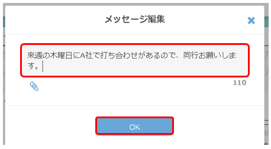

(編集済み)と書かれたメッセージが投稿されます。

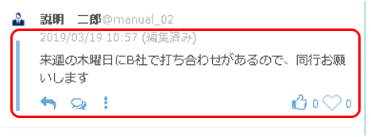

## 5.3.  5.2.0_ajh

①	メッセージを任意のルーム（ＰＪ/ＧＣ/チャット）へ共有する事ができます。

共有したいメッセージの「オプション」アイコンをクリックし、プルダウンメニューを表示します。
プルダウンメニューから、「メッセージ共有」をクリックします。

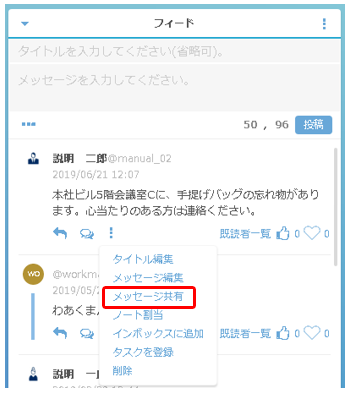

「メッセージ共有」ダイアログでコメントを入力して、「次へ」ボタンをクリックします。

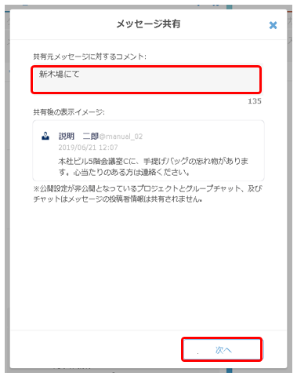

投稿先のルームを選択し、「投稿」ボタンをクリックすると、メッセージが共有されます。

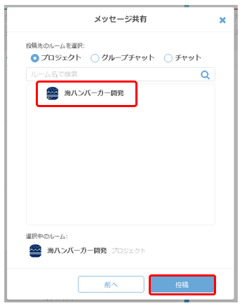

②	新着/自分宛/検索など、複数のルームメッセージが表示されるカラムからルーム移動ができます。

ルーム移動したいメッセージの「オプション」アイコンをクリックし、プルダウンメニューを表示します。

プルダウンメニューから、「ルーム移動」をクリックすると、カラムが追加されます。

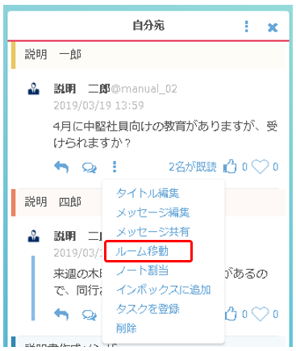

## 5.4.  5.3.0_ajh

①	各メッセージにサンクスポイントが付与できます。

>:point_right: サンクスポイントとは
>
>・投稿者への感情を表現することができます。
>
>・サンクスポイントを組織内での活性の指標等（貢献度）として活用できます。

サンクスポイントを付与するには、メッセージの下部の「サンクスポイント付与」アイコンをクリックし、付与したいポイントを選択します。

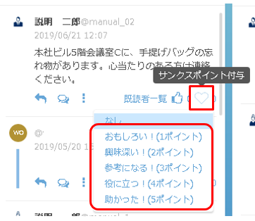

サンクスポイントを付与するとアイコン横のカウントが増えます。

カウントにカーソルを合わせるとサンクスポイントを付与したメンバーを確認する事ができます。

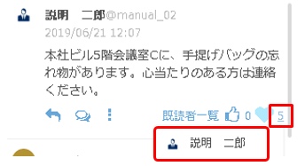

カウントをクリックすると、「サンクスポイント」ダイアログが開き、付与されたサンクスポイントの割合を確認する事ができます。

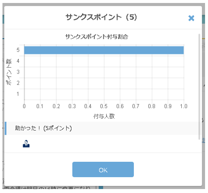

## 5.5.  5.4.0_ajh

①	プロジェクト/グループチャットの公開範囲を設定できます。

公開範囲を設定したいカラム上部の「オプション」アイコンをクリックし、プルダウンメニューを表示します。
プルダウンメニューから、「グループチャット設定」をクリックします。

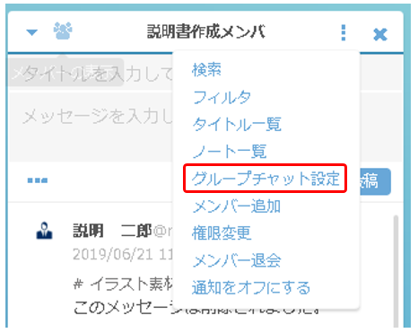

「グループチャット設定」ダイアログで「公開設定」の▼をクリックしてプルダウンの中から公開範囲を選択して、「ＯＫ」ボタンをクリックします。

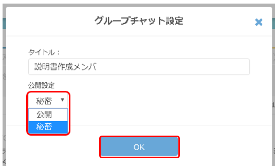

## 5.6.  5.6.0_ajh

ノート機能は、関係者同士で「書き留める」、「見直す」といった、チャットだけでは難しいコラボレーションスタイルを実現します。
ノートツール(CodiMD)をcubeeから使用できます。

関係者同士のテキスト編集による仕様検討、議事メモ作成、アイデア創出などがcubee上で簡単に始められ、そのまま残せます。

>:point_right: CodiMDの説明、機能については以下を参照ください。
>
> https://hackmd.io/b_l4reliTdWOSn9SiCmbJQ

①	ノートを作成することができます。。

左サイドメニューのノート欄の「＋」ボタンの「ノートを作成」をクリックします。

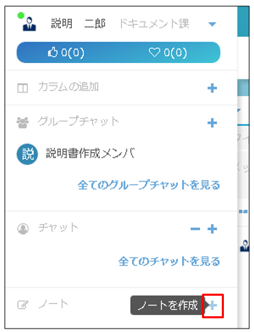

「ノート作成」ダイアログでノート名を入力して、「作成」ボタンをクリックするとノートが作成できます。

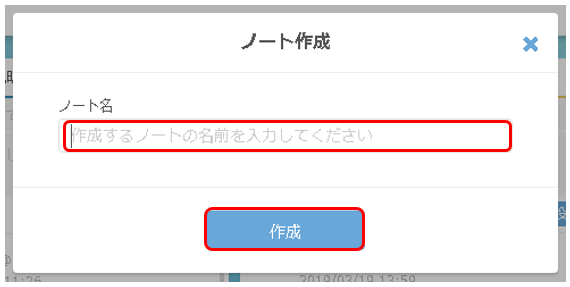

②	作成したノートを削除することができます。

左サイドメニューのノート欄の「－」ボタンの「ノートを削除」をクリックします。

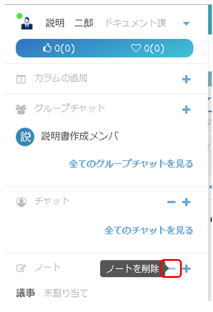

「ノート削除」ダイアログで削除したいノートを選択して、「削除」ボタンをクリックするとノートが削除できます。

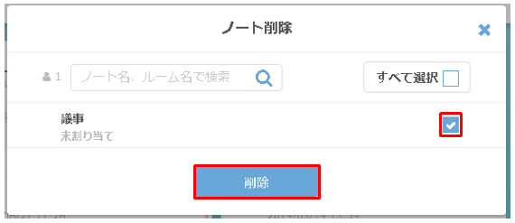

③	作成したノートの一覧を見ることができます。

左サイドメニューのノート欄の「全てのノートを見る」をクリックします。

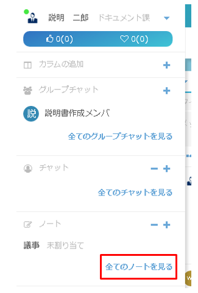

「ノート一覧」ダイアログでみることができます。

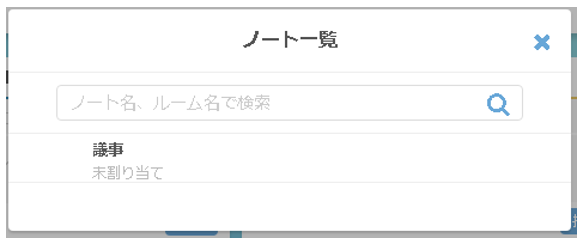

④	メッセージを投稿する際、ノートを割り当て共有することができます。メッセージ新規投稿時、及びスレッドの最上位メッセージのハンバーガーメニューから割り当てるノートを選択することができます。

ノートを割り当てたいカラムの投稿領域の「オプション」アイコンをクリックし、プルダウンメニューを表示します。
プルダウンメニューから、「ノートを割り当てます」をクリックします

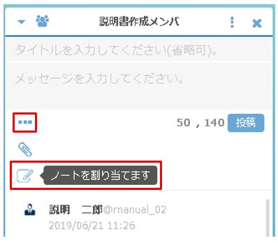

「ノート割当」ダイアログで、スレッドへ割り当てるノートを選択して、「ＯＫ」ボタンをクリックします。

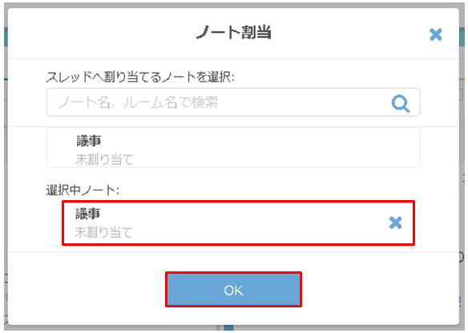

メッセージを入力して、「投稿」ボタンをクリックすると、メッセージにノートを添付して投稿することができます。

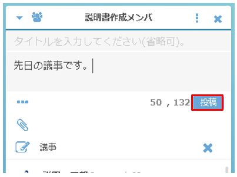

投稿したメッセージに表示されているファイル名をクリックするとファイルを参照できます。

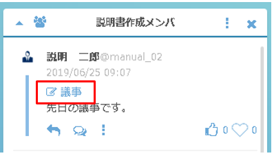

ノート一覧を見たいカラム上部の「オプション」アイコンをクリックし、プルダウンメニューを表示します。
プルダウンメニューから、「ノート一覧」をクリックします。

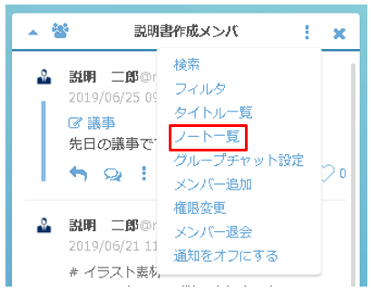

「ノート一覧」ダイアログで、割り当てられているノート一覧が表示され、確認したいノートを選択すると、ノートが表示されます。

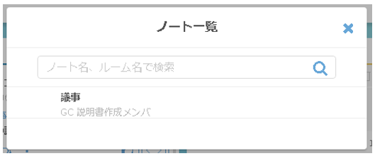

ノートを割り当てたメッセージの「オプション」アイコンをクリックし、プルダウンメニューを表示します。プルダウンメニューから、「ノート割当」をクリックし、「ノート割当」ダイアログを開きます

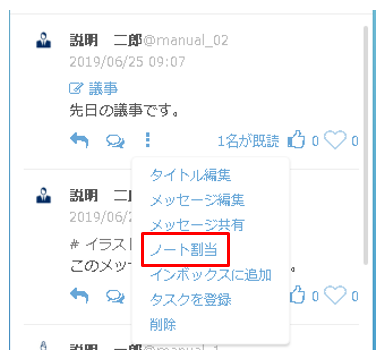

割り当て解除したいノートの「×」ボタンをクリックして、選択中ノート一覧から削除して、「ＯＫ」ボタンをクリックするとノートの割り当てが解除されます。

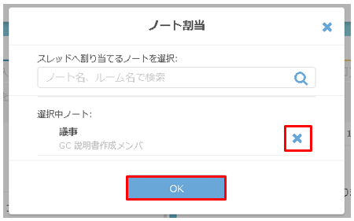

## 5.7.  5.7.0_ajh

①	プロジェクト、グループチャット、フィードの各ルームを対象に匿名型アンケートが実施できます。

左サイドメニューの「カラムを追加」ボタンをクリックすると「カラムを追加」ダイアログが開きます。

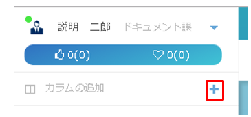

アンケートを指定し、「追加」ボタンをクリックするとダッシュボードにアンケートカラムが表示されます。

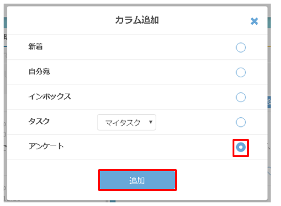

アンケートカラムから「アンケートを登録」ボタンをクリックします。

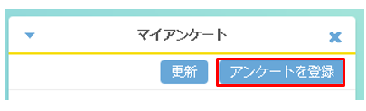

アンケート登録の各項目を入力したら、「ＯＫ」ボタンをクリックします。

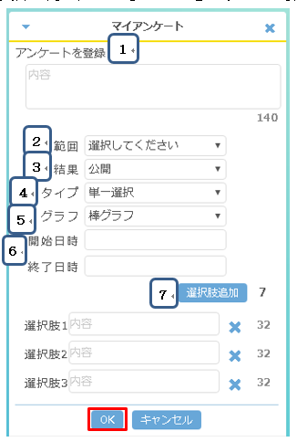

| 番号 | 名称| 説明 |
| -------- | -------- | -------- |
| 1 | アンケートを登録 | 実施するアンケートの説明や概要を記載してください。 |
| 2 | 範囲 | アンケートの公開範囲となります。   プロジェクト、グループチャット、フィード単位での選択が可能であり、指定されたルームに所属するユーザ以外にはアンケートを参照することができません。 |
| 3 | 結果 | アンケート結果を他のユーザに公開するか、非公開とするかを選択できます。   非公開とした場合、アンケート結果はアンケートを作成したユーザのみが参照できます。 |
| 4 | タイプ | アンケートの回答方式を決定します。   複数存在する選択肢のうち、それらを単一選択とするか、複数選択可能とするかを選択可能です。 |
| 5 | グラフ | アンケートの回答結果の表示方法を決定します。   棒グラフ、円グラフの2種類から選択可能です。 |
| 6 | 開始日時   終了日時 | アンケートの開始日時、終了日時を決定します。   開始日時が未来日の場合、開始日時が来るまでアンケートには回答できません。   終了日時が過去日の場合、そのアンケートには回答不可となります。 |
| 7 | 選択肢 | アンケート対象となる選択肢を決定します。   最大10個まで、32文字まで入力可能です。 |

>:point_right: リリース時点ではアンケートの削除、更新は不可です。一度登録すると削除できないので登録内容には注意してください。
>
>アンケートの削除、更新、検索などは今後のアップデートにて実装予定

## 5.8.  5.8.0_ajh

①	OGP(Open Graph Protocol)タグが設定されたHPのURLリンクをメッセージに入力すると、URLリンクサムネイル表示ができます。

チャットカラムでタイトルとメッセージを入力し、「投稿」ボタンをクリックするとリンク先のサムネイルが表示されたメッセージが投稿されます。

>:point_right: ・サムネイルの表示には、タイトル、説明（og:title、og:description）の2つが最低限必要です。これらが設定されていない場合、サムネイルは表示されません。
>
>・イントラ内のページなど外部ネットワークからアクセス不可となるリンク先や認証が必要なリンク先のサムネイルは表示されません。

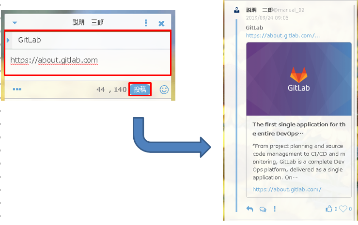

## 5.9.  5.9.0_ajh

①	新着カラムと自分宛カラムを統合し、新着カラム上部へとフィルタ項目が追加され、ここの項目を操作することでフィルタすることができます。

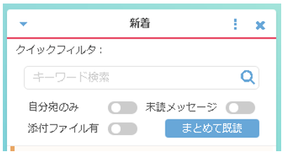

>:point_right: フィルタ可能な項目は以下です。
>
>・キーワード検索：
>メッセージ投稿者、メッセージ本文、添付ファイル名に対する検索を実施します。
>
>・自分宛のみ
>自分宛メッセージのみ表示します。既存の自分宛カラムと同等の機能を有します。
>ここでの自分宛とは、以下の条件に当てはまるメッセージを指します。
>
>‥メッセージ内に自分宛のメンションが含まれる(@<ログインユーザのアカウント名> or @all)
>‥チャットメッセージ
>‥インボックス
>‥自身に割り当てられたタスク
>
>・未読メッセージ
>まだログインユーザが既読としていない状態のメッセージを表示します。
>
>・添付ファイル有
>ファイルが添付されているメッセージのみ表示します。
>
>・まとめて既読
>新着カラム上へ表示中のメッセージをすべて既読にします。

②	ルームに属する全メンバー宛を意味するメンション、@allを使用できます。

「@」と入力するとメンションの入力候補にでてきます。

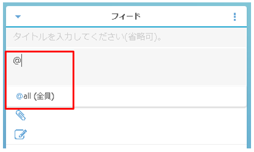

③	新着カラムからタイトルの一覧を取得することができます。

カラム上部の「オプション」アイコンをクリックし、プルダウンメニューを開いて、プルダウンメニューの「タイトル一覧」をクリックします。、「タイトル一覧」ダイアログが開きます。

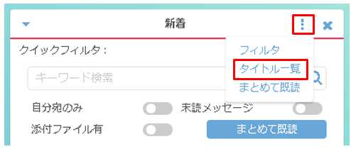

④	ハッシュタグを付与することができます。

言葉の頭へ#(半角のシャープ)をつけることでメッセージへタグ付します。

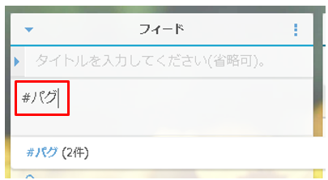

メッセージへ付与されたハッシュタグをクリックすることで、参照可能なメッセージで同一のハッシュタグが付与されたメッセージカラムが表示されます。

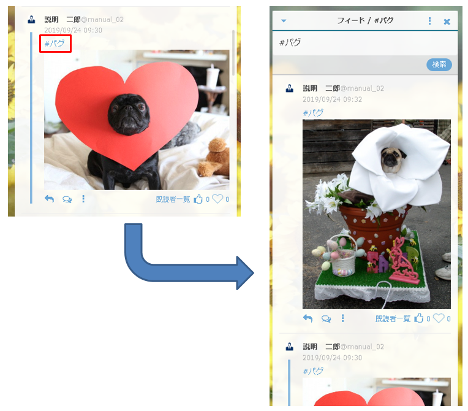

>:point_right: タグ付における制限は以下です。
>
>・最大文字数：30文字(#は含まない)
>
>・使用禁止文字：!"#$%&'()*+,-./:;<=>?@[\]^_`{|}~
>
> ※ハッシュタグはメッセージ文字数にカウントされませんが、上記の制限から逸脱した場合はカウントされるようになります。
>
>また、ハッシュタグとしてメッセージ上へ表示されなくなりますのでご注意ください。

⑤	カラム内のメッセージをまとめて既読にすることができます。

カラム上部の「オプション」アイコンをクリックし、プルダウンメニューを開いて、プルダウンメニューの「まとめて既読」をクリックします。、「確認」ダイアログが開きます。

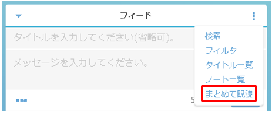

「ＯＫ」ボタンをクリックすると、カラム上へ表示されている全てのメッセージを既読とします。

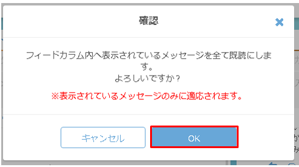

## 5.10.  v5.10.0_ajh

①	メッセージ投稿時やメッセージ返信時に絵文字をスタンプとして利用できます。

カラムの投稿領域の投稿ボタン横の「🙂」アイコンをクリックすると、pickerが表示されます。

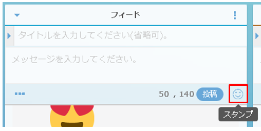

投稿したい絵文字を選択すると、絵文字スタンプが投稿されます。

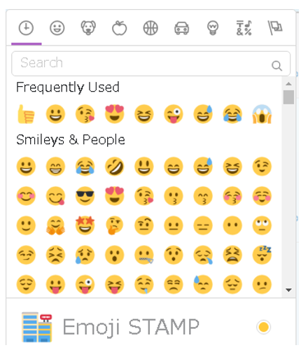

>:point_right: picker上の絵文字を選択するとすぐにスタンプが投稿されます。
>
>削除は可能ですが、編集は不可となっています。
>
>絵文字はメッセージ内に入れることはできず、単体で投稿されます。

②	メッセージにタイトルを指定する際、カテゴリを指定できます。

カラムの投稿領域のタイトル入力欄左端の「▶」アイコンをクリックして、カテゴリを選択して、メッセージを投稿します。

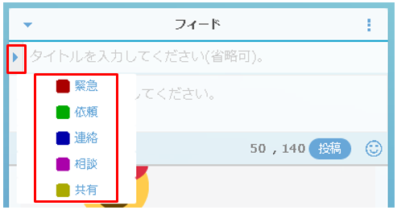

③	メンションしたい相手を一覧から選択できます。

メッセージ入力エリア上にある「@」アイコンをクリックすると、メンション指定が可能なダイアログが表示されます。

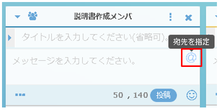

「メンション指定」ダイアログでメンションしたい人を選択し、「ＯＫ」ボタンをクリックします。

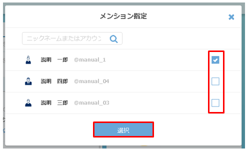

>:point_right: このダイアログで、属するルームのルームメンバが簡単に指定できます。
>
>グループチャットとプロジェクトフィードで利用可能です。

④	140文字を超えた部分のメッセージが省略表示されます。

>:point_right: Bot等により長いメッセージが投稿された場合です。
>
>通常の操作では140文字以上のメッセージは入力できない為、メッセージは省略表示が行われることはありません。

⑤	ダッシュボードの背景を変更できます。

左サイドメニューの最上段にある▼アイコンのアカウント設定をクリックすると、サブメニューが表示されます。サブメニューのプロフィール設定をクリックして、「プロフィール変更」ダイアログを表示してください

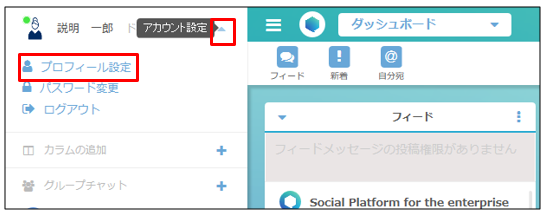

「プロフィール変更」ダイアログで、ダッシュボード背景設定し、「登録」ボタンをクリックしてください。

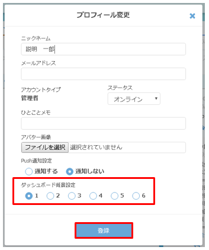

⑥	作成したアンケートを削除できます。

削除したいアンケートの「オプション」アイコンをクリックし、プルダウンメニューを表示します。プルダウンメニューから、「削除」をクリックすると、「削除」ダイアログを開きます。

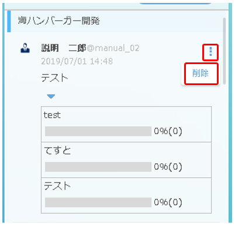

「削除」ダイアログで「ＯＫ」ボタンをクリックします。

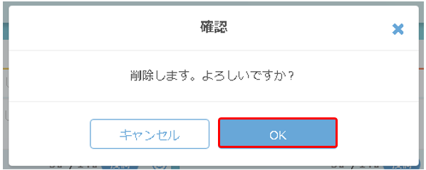

アンケートが削除されます。

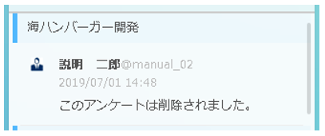

## 5.11.  v5.11.0_ajh

①	プロジェクトタブ上で新着フローティングバーを表示できます。

プロジェクト画面で新着メッセージを受信すると画面右上の「新着」アイコンに新着マークが点灯します。

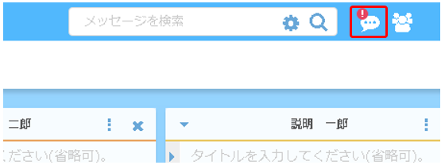

「新着」アイコンをクリックします。

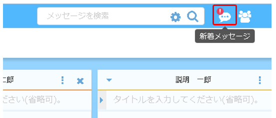

右側に新着メッセージを表示可能なフローティングバーが表示されます。

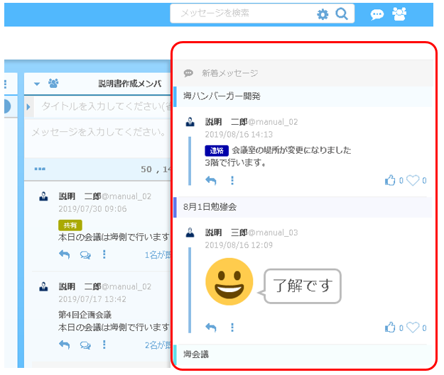

>:point_right: これにより、PJタブ上で新着メッセージを確認可能とし、ダッシュボード⇔PJタブにおける移動を行わなくとも最小限の動きで新着メッセージに対するアクションが可能。

※この機能装備に伴い、プロジェクトに関係のないカラムを余分に開いてしまうことを防止することを狙って、使用率の低かった新着アイコンを試験的に廃止しました。

②	会話を見るの表示の仕方が改善され、「会話を見ます」アイコンをクリックした元のメッセージをわかりやすく表示されます。

一連の会話を見たいメッセージの「会話を見ます」アイコンをクリックします。

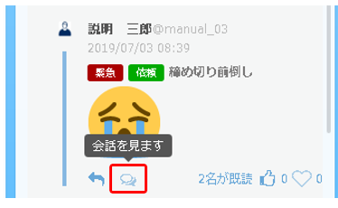

会話を見るカラムが開きます。

・そのクリック元メッセージへスクロールされます。

・クリック元メッセージをブリンク(点滅)表示されます。

・クリック元メッセージの背景を青色に強調されます。

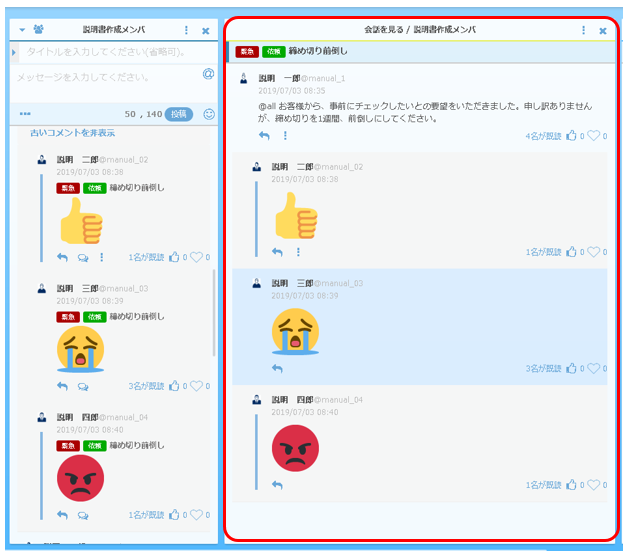

③	メッセージ付きスタンプを投稿できます。

チャットカラムでスタンプを投稿する前にメッセージを入力します。

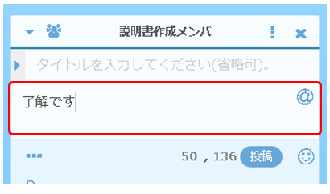

カラムの投稿領域の投稿ボタン横の「🙂」アイコンをクリックすると、pickerが表示されます。

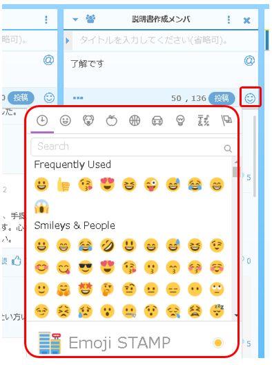

投稿したい絵文字を選択すると、入力したメッセージが吹き出しとして投稿されます。

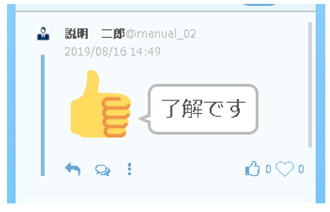

④	タイトルカテゴリに任意の文字列を指定できます。

カテゴリ最大数は5、最大文字数は2です。

カテゴリ色は、入力された文字列によって16色に変化します。

>:point_right: カテゴリ最大数は5、最大文字数は2です。
>
>カテゴリ色は、入力された文字列によって16色に変化します。

※v5.10.0_ajhにおいてタイトルカテゴリは、タイトル文字数に含めない仕様でしたが、任意に入力が可能となったことで文字数に含めるように変更しました。

⑤	ノート名を変更できます。

左サイドメニューのノート欄の「全てのノートを見る」をクリックします。

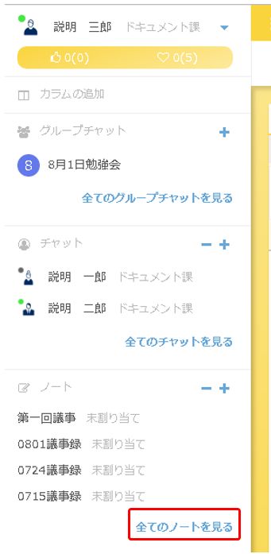

「ノート一覧」ダイアログでノート名を入力して、鉛筆マークをクリックします。

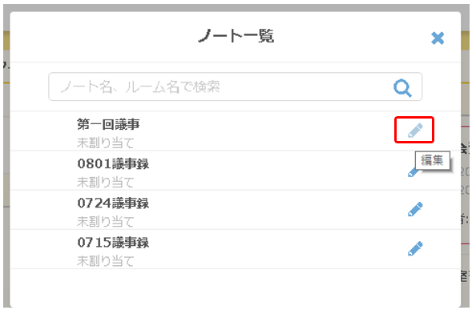

ノート名を修正し、チェックボタンを押して保存します。

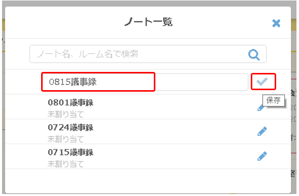

>:point_right: ノート一覧ダイアログのノート表示順は更新順です。
>
>ノート名を変更すると最上位に表示されます。

⑥	チャット/プロジェクト/グループチャット内で、タイトル／ノート一覧ダイアログ上で、検索できるようになりました。

カラム上部の「オプション」アイコンをクリックし、プルダウンメニューを開いて、プルダウンメニューの「タイトル一覧／ノート一覧」をクリックします。、「タイトル一覧」ダイアログが開きます

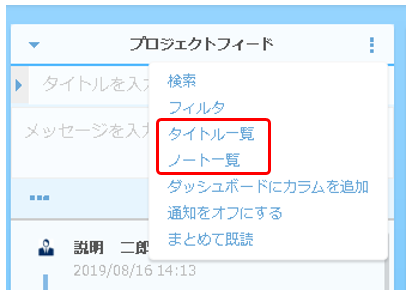

※タイトルの検索の仕方は　5.2. 5.0.2_ajh　の②を参照

※ノートの検索の仕方は　5.6 5.6.0_ajh　の④を参照

## 6.動作環境

Webブラウザの動作環境は以下の通りです。

①	OS

+ Microsoft Windows 10
+ Microsoft Windows 7

②	Webブラウザ

+ Microsoft Edge	
+ Internet Explorer 11
+ Firefox Quantum
+ Google Chrome

## 7.注意制限事項

+ １つのブラウザで複数の企業向けソーシャルプラットフォームへログインしている場合、そのいずれかをログアウトすると、他の企業向けソーシャルプラットフォームへの自動ログイン状態も解除されます。自動ログイン状態の場合は、F5を押下して画面をリロードしたり、ブラウザを再起動した場合に、前のユーザで自動的にログインして画面が開きますが、これが解除されると、ログイン画面が表示されます。

+ メールアドレスを記載したメッセージに返信すると、そのメールアドレスの@以降がメンション（企業向けソーシャルプラットフォームのメッセージ中に記載した宛先アカウント名）として表示されます。

+ メイン画面を表示している際にブラウザの横幅を小さくすると、画面右上の検索ボックスが隠れて見えない場合があります。

+ ユーザ登録時、ニックネームを指定しないとチャットリスト等でニックネームとしてアカウント名が表示される場合があります。テナント管理者はユーザ登録をする際、ニックネームを空にしないでください。

+ メッセージ入力中にプロジェクトを切り替えた場合や、サーバとの通信が正しく行えなかった場合、入力途中のメッセージは保持されません。

## 8.商標について

下記の他社登録商標・商標をはじめ、本資料に記載されているシステム名、製品名は一般に各社の登録商標または商標です。

+ Microsoft、Windows、Internet Explorer、Microsoft Edgeは米国およびその他の国におけるMicrosoft Corporation およびその関連会社の商標または登録商標です。

+ Mozilla Firefoxの名称およびそのロゴは、米国Mozilla Foundationの米国およびその他の国における商標または登録商標です。

+ Google Chromeの名称およびそのロゴは、米国Google Inc.の米国およびその他の国における商標または登録商標です。
